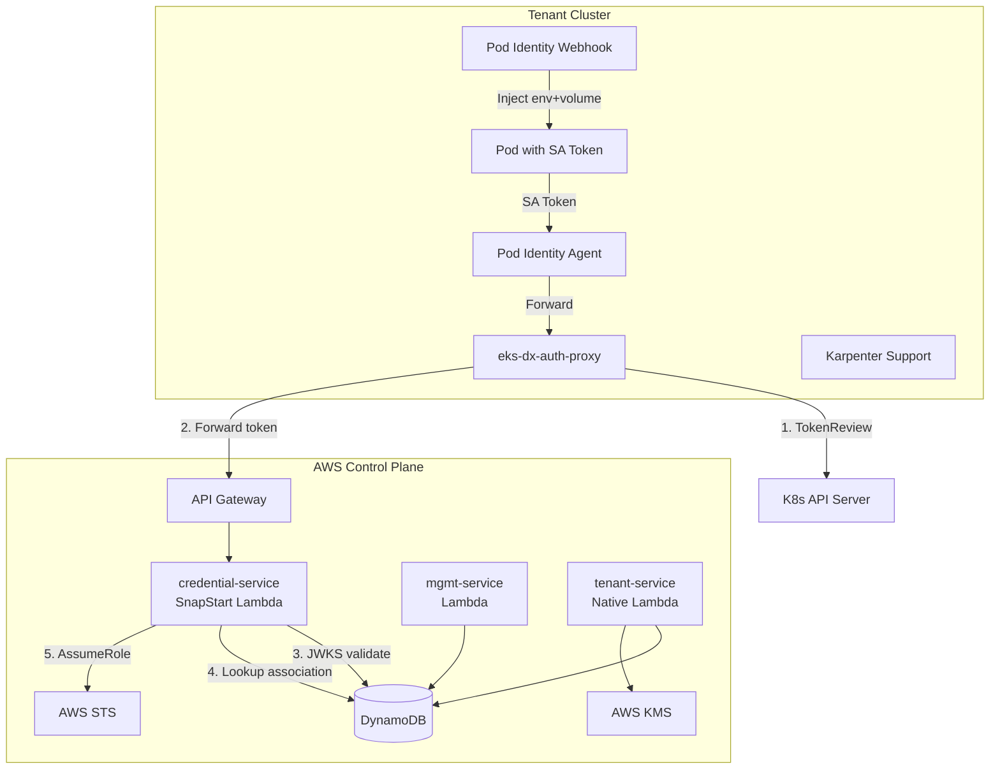
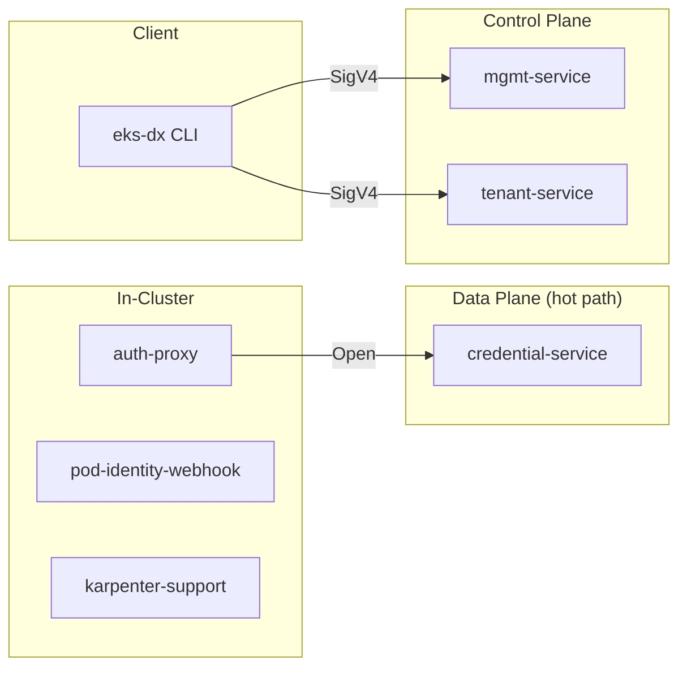

# Architecture

## System Overview

EKS-DX brings EKS Pod Identity (`AssumeRoleForPodIdentity`) to non-EKS Kubernetes clusters (EKS-D, k3s, microk8s) through a centralized serverless backend with DynamoDB storage and KMS-backed PKI.

## Architectural Layers

## Design Principles

1. **Hot-path isolation**: Credential exchange (data plane) is separated from management operations. The credential-service uses SnapStart for cold-start latency optimization.

2. **Composable provisioning with compensating rollback**: Tenant provisioning is decomposed into discrete service calls (network, crypto, IAM, SQS, DLM, EC2). `ProvisionedResources` tracks created resources; on failure, `rollback()` cleans up in reverse order.

3. **KMS-backed PKI**: Tenant CA certificates are signed by a shared KMS asymmetric key. SA signing keys and JWKS are pre-registered in DynamoDB before EC2 launch — no post-boot registration needed.

4. **Dual-mode cluster lifecycle**: The unified `POST /clusters` endpoint handles both managed (full EC2 provisioning) and self-managed (BYOK register-only). Mode is inferred from request body.

5. **O(1) credential lookup**: DynamoDB uses `PK=CLUSTER#<name>` / `SK=<namespace>#<serviceAccount>` for instant GetItem during credential exchange.

6. **Per-user tenancy**: `CallerIdentityFilter` extracts `idcUserId` from IAM Identity Center session names. Quota enforcement is per-user.

## Authentication Model

| Endpoint | Auth Method | Details |
|----------|-------------|---------|
| `POST /clusters/{name}/assets` | None (API GW level) | Token validated by Lambda via JWKS |
| Management APIs | IAM SigV4 | Via API Gateway authorizer |
| Tenant-service Function URL | IAM SigV4 | Direct Lambda invocation |
| Pod SA tokens | JWT | Audience: `pods.eks.amazonaws.com` |
| In-cluster proxy → K8s | TokenReview | Fast-fail before Lambda call |

## Infrastructure Patterns

- **SSM Parameter Contract**: Infrastructure (CDK) writes parameters, Lambda reads at runtime. Decouples deployment timing.
- **Shared VPC**: All tenants share a VPC; each gets a dedicated subnet + security group.
- **Naming conventions**: Shared infra uses `eks-d-xpress-` prefix; per-tenant uses `eks-dx-tenant-` prefix (via `TenantNaming` class).
- **Platform tagging**: Shared resources tagged `Platform=eks-d-xpress`.
