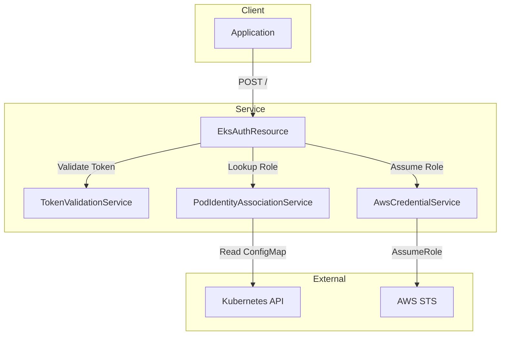
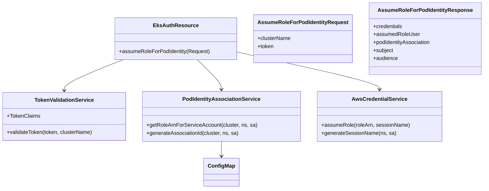
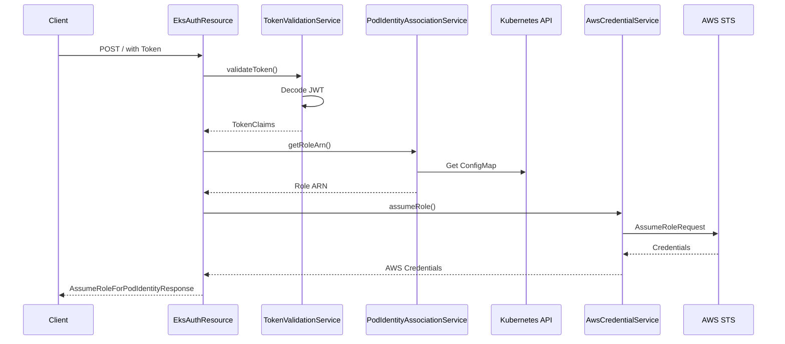
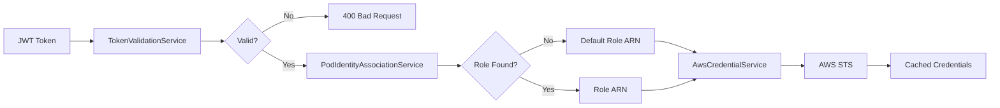
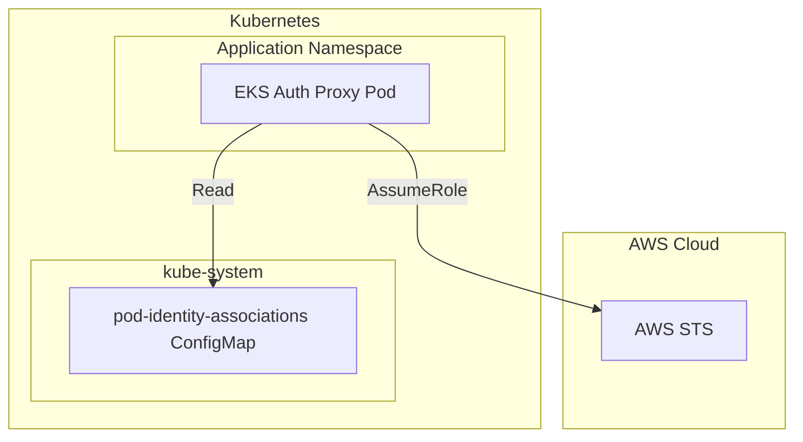

# Architecture Overview

## System Architecture

## Component Relationships

## Data Flow

## Design Patterns

| Pattern | Usage |
|---------|-------|
| RESTful API | HTTP endpoints for AssumeRoleForPodIdentity |
| Dependency Injection | CDI @ApplicationScoped services |
| Service Layer | Separation of concerns in service layer |
| DTO Pattern | Request/Response models |
| Health Checks | Quarkus SmallRye Health |
| Metrics | Micrometer Prometheus registry |

## Security Architecture

## Deployment Architecture

