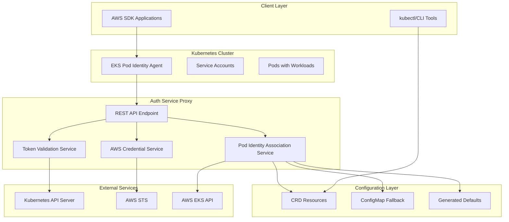
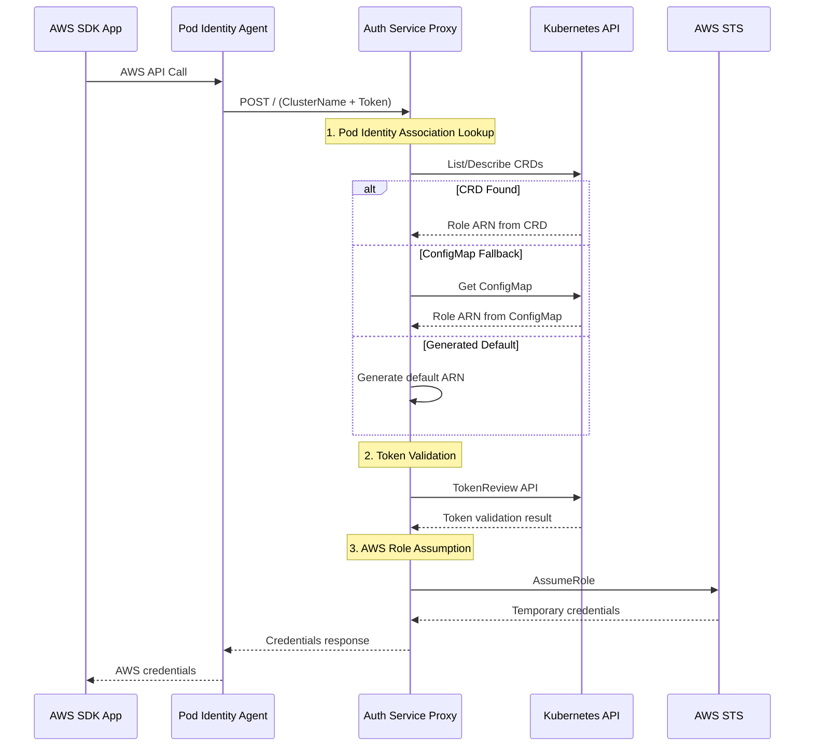
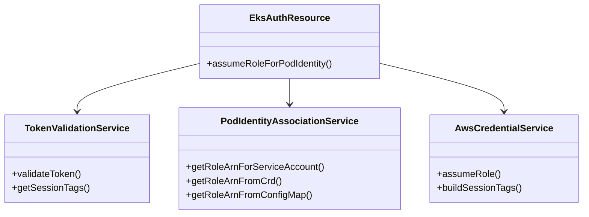
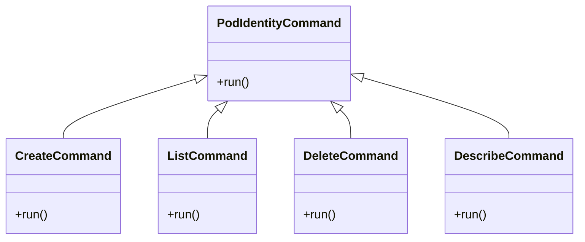
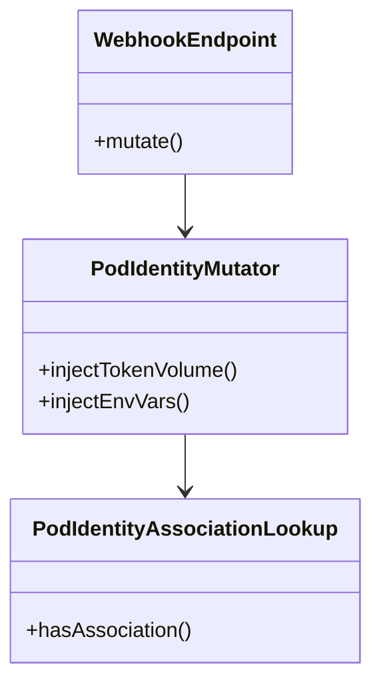

# System Architecture

## Overview

The AWS EKS Auth Service Proxy is a multi-module system that replicates AWS EKS Pod Identity authentication for local development and CI/CD environments. It follows a microservices architecture with clear separation of concerns.

## High-Level Architecture

## Authentication Flow

## Module Architecture

### eks-auth-proxy (Core Service)

### eks-d-auth-cli (Management Tool)

### eks-pod-identity-webhook (Admission Controller)

## Design Patterns

### Dependency Injection (CDI)
- Quarkus CDI for service management
- Producer methods for AWS clients
- Scoped beans for lifecycle management

### Fallback Strategy Pattern
1. **Primary**: EKS API for pod identity associations
2. **Secondary**: Kubernetes ConfigMap
3. **Tertiary**: Generated default role ARN

### Validation Chain Pattern
1. **Request validation**: JSON structure and required fields
2. **Token validation**: Kubernetes TokenReview API
3. **Authorization**: Role mapping and AWS permissions

### Configuration Hierarchy
1. **Environment variables**: Runtime configuration
2. **Application properties**: Default settings
3. **CRD resources**: Dynamic associations
4. **ConfigMap**: Static fallback mappings

## Security Architecture

### Token Security
- JWT signature validation via Kubernetes API
- Audience validation (`pods.eks.amazonaws.com`)
- Token expiration enforcement
- Bearer token prefix handling

### AWS Security
- IAM role assumption with session tags
- Temporary credential generation
- Session duration limits (1 hour default)
- Least privilege principle

### Kubernetes Security
- Service account token validation
- RBAC for CRD access
- Admission webhook TLS
- Namespace isolation

## Scalability Considerations

### Horizontal Scaling
- Stateless service design
- Multiple proxy instances supported
- Load balancer compatible

### Performance Optimizations
- Native compilation for CLI (GraalVM)
- Async HTTP processing (Vert.x)
- Connection pooling for AWS clients
- Kubernetes client caching

### Resource Management
- Memory limits (10GB build, 8GB runtime)
- CPU limits (4 cores build)
- Container resource requests/limits
- JVM heap optimization
