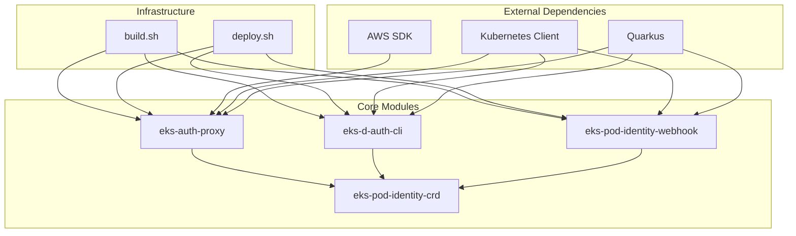

# Codebase Information

## Overview
- **Total Files**: 526
- **Prioritized Files**: 33 (key implementation files)
- **Lines of Code**: 2,858
- **Size Category**: Large (L)
- **Primary Language**: Java
- **Framework**: Quarkus

## Module Structure

## File Distribution by Module

| Module | Files | Key Components | Purpose |
|--------|-------|----------------|---------|
| `eks-auth-proxy` | ~200 | REST API, Services, Tests | Main authentication service |
| `eks-d-auth-cli` | ~50 | CLI Commands | Management tool for associations |
| `eks-pod-identity-webhook` | ~30 | Webhook handlers | Kubernetes admission controller |
| `eks-pod-identity-crd` | ~20 | CRD definitions | Custom resource schemas |
| Root | ~226 | Build/deploy scripts | Infrastructure automation |

## Technology Stack

### Core Technologies
- **Java 21**: Primary programming language
- **Quarkus 3.20.3**: Application framework
- **Maven**: Build system
- **Docker/Jib**: Containerization
- **GraalVM**: Native compilation (CLI)

### AWS Integration
- **AWS SDK for Java**: EKS and STS clients
- **IAM**: Role assumption and policies
- **EKS**: Pod Identity associations
- **STS**: Temporary credential generation

### Kubernetes Integration
- **Fabric8 Kubernetes Client**: K8s API interactions
- **Custom Resource Definitions**: Pod identity associations
- **Admission Webhooks**: Pod mutation
- **Service Account Tokens**: JWT validation

## Build and Deployment

### Build System
- Multi-module Maven project
- Jib for container image building
- Native compilation support for CLI
- Resource limits configured (10GB memory, 4 CPU)

### Deployment Options
- Docker containers via Jib
- Kubernetes manifests
- ECR integration
- Local development mode

## Testing Strategy
- Unit tests with JUnit 5
- Integration tests with real AWS resources
- Mock server testing with WireMock
- Kubernetes client mocking with Fabric8
