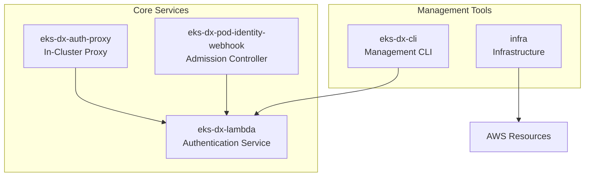
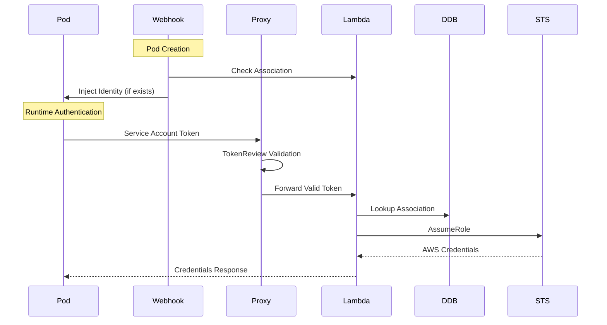
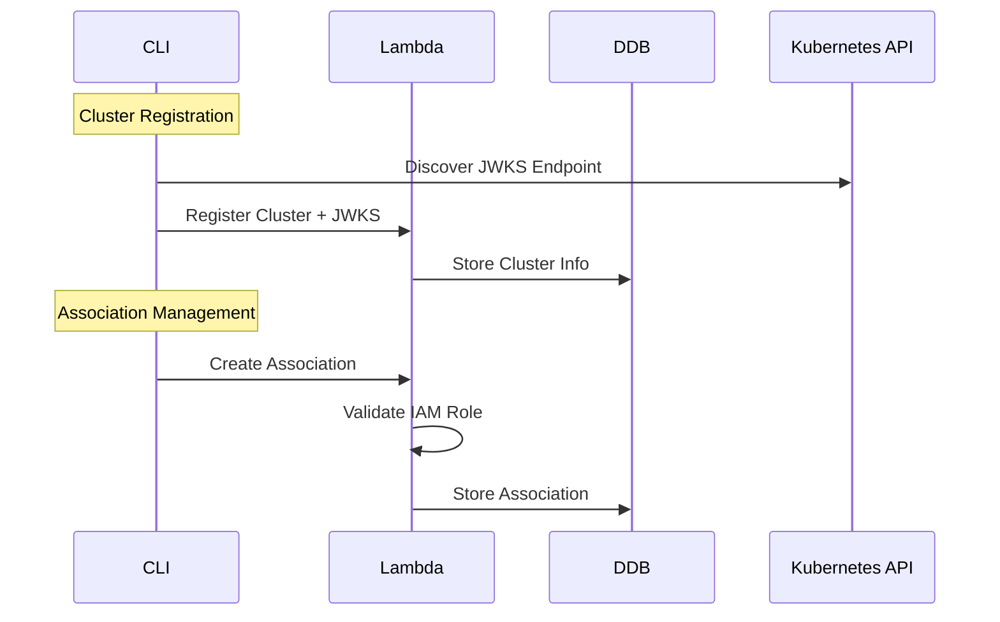

# Major Components

## Component Overview

The EKS-DX Control Plane consists of five major components, each with distinct responsibilities in the authentication and management workflow.

## eks-dx-lambda (Core Authentication Service)

### Purpose
Central authentication service that validates JWT tokens and exchanges them for AWS credentials.

### Key Classes
- **EksAuthResource**: Main API endpoint for credential exchange
- **ClusterResource**: Cluster registration and management
- **AssociationResource**: Pod identity association CRUD operations
- **JwksTokenValidationService**: JWT signature validation with JWKS
- **DynamoDbClusterService**: Cluster data persistence
- **DynamoDbAssociationService**: Association data persistence
- **AwsCredentialService**: STS integration for credential exchange

### Responsibilities
- JWT token validation using JWKS
- Association lookup in DynamoDB
- AWS STS AssumeRole operations
- Session tag propagation from Kubernetes metadata
- RESTful API for management operations

### Integration Points
- **DynamoDB**: Cluster and association storage
- **AWS STS**: Credential exchange
- **Kubernetes JWKS**: Token signature validation

## eks-dx-cli (Management CLI)

### Purpose
Native command-line interface for managing clusters and pod identity associations.

### Key Classes
- **EksDxCommand**: Main CLI entry point with picocli
- **CreateClusterCommand**: Cluster registration with JWKS discovery
- **CreateAssociationCommand**: Association creation
- **EksDxApiClient**: HTTP client with AWS SigV4 authentication
- **AwsSigV4Signer**: Custom AWS signature implementation
- **EksDxConfig**: Configuration management (~/.eks-dx/config)

### Responsibilities
- Cluster lifecycle management (create, update, delete, list, describe)
- Association lifecycle management (create, delete, list, describe)
- JWKS discovery from Kubernetes API servers
- AWS SigV4 request signing for API authentication
- Configuration management and persistence

### Integration Points
- **EKS-DX Lambda API**: All management operations
- **Kubernetes API**: JWKS endpoint discovery
- **AWS Credentials**: SigV4 signing for API requests

## eks-dx-auth-proxy (In-Cluster Proxy)

### Purpose
In-cluster component that provides fast-fail token validation and forwards requests to the Lambda service.

### Key Classes
- **EksAuthAgentResource**: Main proxy endpoint
- **TokenValidationService**: Kubernetes TokenReview integration
- **LambdaForwardingService**: HTTP forwarding to Lambda API

### Responsibilities
- Kubernetes TokenReview validation (fast-fail)
- HTTP request forwarding to Lambda service
- Error handling and status code translation
- Health check endpoints for Kubernetes probes

### Integration Points
- **Kubernetes API**: TokenReview for signature validation
- **EKS-DX Lambda**: Token forwarding for credential exchange

## eks-dx-pod-identity-webhook (Admission Controller)

### Purpose
Kubernetes admission webhook that mutates pods to inject AWS credentials environment variables and projected service account tokens.

### Key Classes
- **WebhookEndpoint**: Admission controller HTTP endpoint
- **PodIdentityMutator**: Pod mutation logic
- **LambdaAssociationLookup**: Association existence checking

### Responsibilities
- Pod mutation for identity injection
- Environment variable injection (AWS_ROLE_ARN, AWS_WEB_IDENTITY_TOKEN_FILE)
- Projected token volume mounting
- Association existence validation before mutation

### Integration Points
- **Kubernetes API**: Admission webhook registration
- **EKS-DX Lambda**: Association lookup API

## infra (Infrastructure as Code)

### Purpose
AWS CDK infrastructure definitions for deploying the complete system.

### Key Classes
- **InfraApp**: CDK application entry point
- **EksDxStack**: Complete AWS infrastructure stack

### Responsibilities
- Lambda function deployment with SnapStart
- DynamoDB table creation with PITR
- API Gateway configuration with IAM authentication
- CloudWatch alarms and monitoring setup
- IAM roles and policies for Lambda execution

### Integration Points
- **AWS CDK**: Infrastructure deployment framework
- **AWS Services**: Lambda, DynamoDB, API Gateway, CloudWatch

## Component Interactions

### Authentication Flow

### Management Flow

## Component Dependencies

### Runtime Dependencies
- **eks-dx-lambda**: DynamoDB, AWS STS, jose4j
- **eks-dx-cli**: JDK HttpClient, picocli, AWS credentials
- **eks-dx-auth-proxy**: Kubernetes client, JDK HttpClient
- **eks-dx-pod-identity-webhook**: Kubernetes client, JDK HttpClient
- **infra**: AWS CDK, AWS SDK

### Build Dependencies
- **All Components**: Maven, Quarkus BOM
- **CLI**: GraalVM native-image
- **Containers**: Quarkus container-image extension
- **Infrastructure**: AWS CDK CLI

## Component Configuration

### Environment Variables
| Component | Key Variables | Purpose |
|-----------|---------------|---------|
| eks-dx-lambda | `eks-dx.clusters-table`, `eks-dx.associations-table` | DynamoDB table names |
| eks-dx-auth-proxy | `EKS_DX_ENDPOINT` | Lambda API Gateway URL |
| eks-dx-pod-identity-webhook | `EKS_CLUSTER_NAME`, `EKS_DX_ENDPOINT` | Cluster identification and API URL |

### Configuration Files
| Component | File | Purpose |
|-----------|------|---------|
| eks-dx-cli | `~/.eks-dx/config` | API endpoint and region |
| All | `application.properties` | Quarkus configuration |
