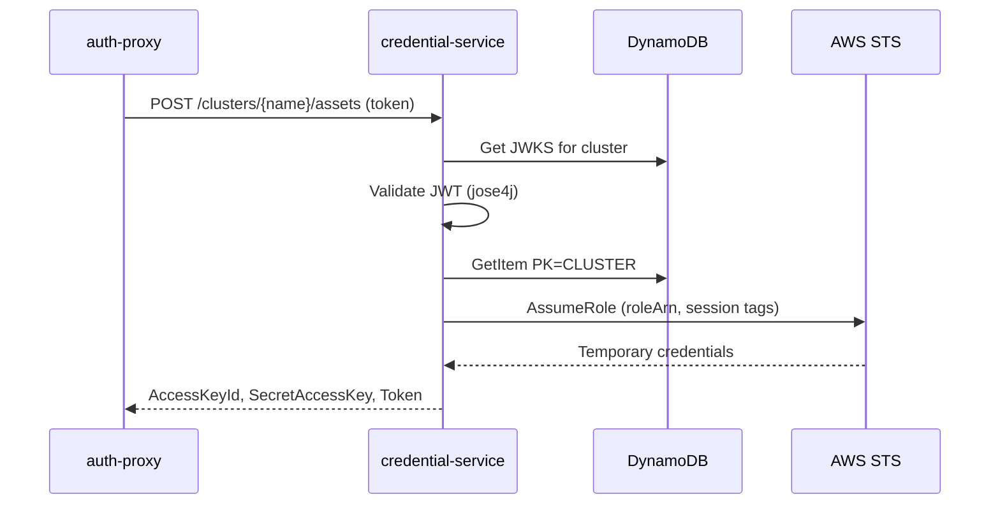

# Components

## Lambda Services

### credential-service (Data Plane)

Hot-path credential exchange. Receives pod SA tokens, validates via JWKS, looks up association, calls STS AssumeRole.

**Key classes:**
- `EksAuthResource` — REST endpoint, request/response DTOs
- `JwksTokenValidationService` — JWT validation with DynamoDB-cached JWKS
- `AwsCredentialService` — STS AssumeRole with session tags

**Runtime**: JVM with SnapStart, 512MB

### mgmt-service (Control Plane)

Cluster and association CRUD, JWKS refresh, trust policy management.

**Key classes:**
- `ClusterResource` — Register/deregister/describe/list clusters
- `AssociationResource` — Create/delete/describe/list pod identity associations
- `DynamoDbClusterService` — Cluster DynamoDB operations
- `DynamoDbAssociationService` — Association DynamoDB operations
- `TrustPolicyService` — Adds/removes trust statements on target IAM roles
- `JwksTokenValidationService` — Webhook token validation
- `CallerIdentityFilter` — Extracts caller ARN from API Gateway context
- `WebhookAuthFilter` — Validates webhook requests via JWKS

**Runtime**: JVM, 256MB

### tenant-service (Control Plane)

Tenant cluster lifecycle: provisioning, stop/resume, delete. Most complex module.

**Key classes:**
- `ClusterResource` — Unified create (managed/self-managed), delete, stop/resume
- `TenantResource` — Legacy tenant endpoints
- `TenantStreamResource` — SSE progress streaming via SQS polling
- `TenantProvisioningService` — Orchestrator with rollback
- `TenantNetworkService` — Subnet, security group, route table creation
- `TenantCryptoService` — KMS-signed CA, SA keys, JWKS derivation
- `TenantIamService` — Role, inline policy, instance profile
- `TenantEc2Service` — Instance launch, user data, EIP
- `TenantDlmService` — Etcd backup lifecycle policies
- `TenantNaming` — Resource name constants and factory methods
- `CallerIdentityFilter` — Per-user identity extraction (idcUserId)
- `DryRunProvisioningService` — Simulated events for dry-run mode

**Runtime**: Native arm64 (production) or JVM (dev), 128MB, 15-min timeout

## In-Cluster Components

### auth-proxy

Sidecar that validates pod tokens via Kubernetes TokenReview (fast-fail) then forwards to credential-service Lambda.

**Key classes:**
- `EksAuthAgentResource` — Main endpoint, accepts pod token
- `TokenValidationService` — K8s TokenReview via Fabric8 client
- `EksDxCredentialServiceClient` — HTTP forwarding to Lambda API Gateway
- `HealthResource` — Liveness/readiness probes

**Deployment**: Helm chart (`eks-d-xpress-auth-proxy`)

### pod-identity-webhook

Mutating admission webhook that injects environment variables and projected token volumes into pods with matching associations.

**Key classes:**
- `WebhookEndpoint` — Admission review handler
- `PodIdentityMutator` — Mutation logic (env vars + token volume + volume mount)
- `LambdaAssociationLookup` — Checks if pod has a matching association

**Deployment**: Helm chart (`eks-d-xpress-pod-identity-webhook`)

### karpenter-support

EC2NodeClass mutating webhook + ValidationSucceeded status reconciler. Injects cluster identity (API server endpoint, CA, service CIDR) into Karpenter node classes.

**Key classes:**
- `Ec2NodeClassWebhookResource` — Mutation webhook (amiFamily→Custom, inject userData/tags)
- `Ec2NodeClassReconciler` — Sets ValidationSucceeded condition on EC2NodeClass
- `ClusterIdentityService` — Resolves cluster identity from kube-system ConfigMap
- `UserDataMergeService` — MIME multipart merge for AL2023/Bottlerocket
- `AmiAliasResolverService` — Resolves AMI aliases to concrete IDs
- `NodePoolArchService` — Determines architectures from NodePool constraints
- `ValidationConditionService` — Manages status conditions

**Deployment**: Helm chart (`eks-d-xpress-karpenter-support`)

## CLI

Native binary providing cluster and association management.

**Key classes:**
- `EksDxCommand` — Picocli top-level command
- `UnifiedCreateClusterCommand` — `create-cluster` (managed + self-managed)
- `UnifiedDeleteClusterCommand` — `delete-cluster`
- `GetClusterAccessCommand` — SSH access to managed clusters
- `EksDxApiClient` — HTTP client with SigV4 signing
- `AwsSigV4Signer` — AWS Signature V4 implementation
- `KubeApiClient` — Reads kubeconfig, fetches OIDC/JWKS
- `EksDxConfig` — CLI configuration (`~/.eks-dx/config`)

## Infrastructure (CDK)

Single CDK stack deploying all control-plane resources.

**Key class**: `EksDXpressControlPlaneStack` — API Gateway, Lambda functions, DynamoDB tables, IAM roles, SSM parameters.
