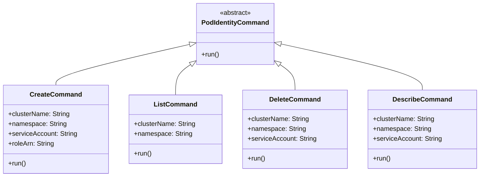
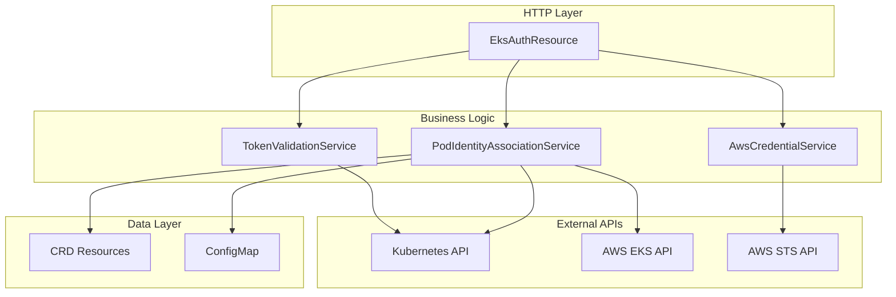
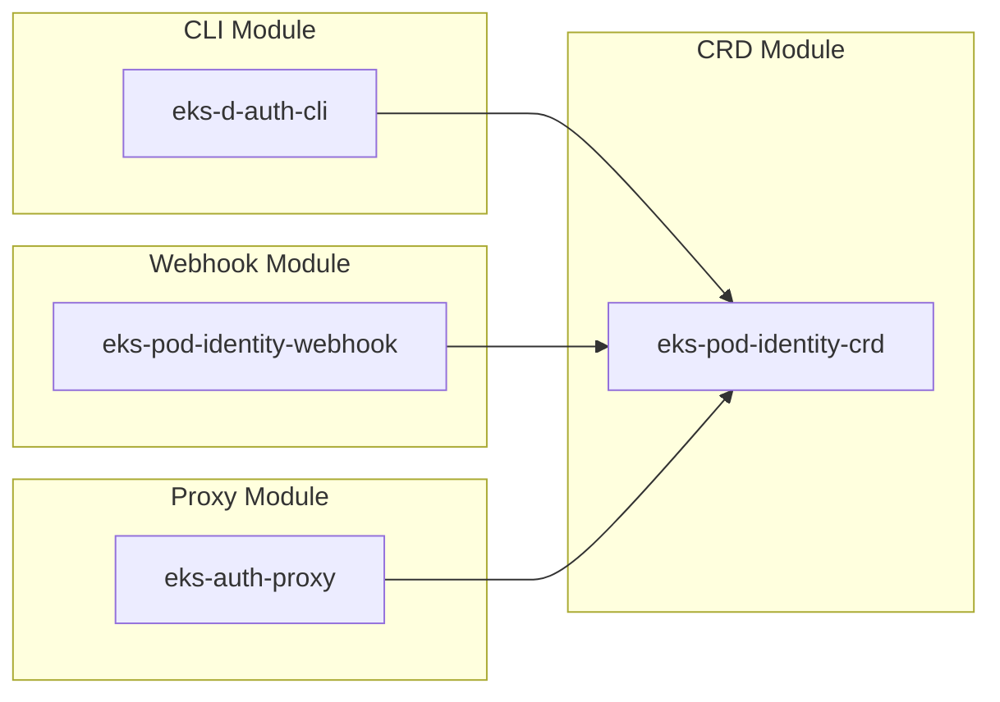

# System Components

## Core Components Overview

The system consists of four main modules, each with distinct responsibilities in the EKS Pod Identity authentication flow.

## eks-auth-proxy Module

### Primary Components

#### EksAuthResource
- **Purpose**: REST API endpoint for pod identity authentication
- **Key Method**: `assumeRoleForPodIdentity()`
- **Responsibilities**:
  - Handles HTTP POST requests to root path (`/`)
  - Orchestrates the four-step validation process
  - Returns AWS temporary credentials
- **Dependencies**: All service components

#### TokenValidationService
- **Purpose**: Kubernetes service account token validation
- **Key Methods**: 
  - `validateToken()`: Validates JWT via TokenReview API
  - `getSessionTags()`: Extracts metadata for AWS session tags
- **Responsibilities**:
  - JWT signature verification (delegated to K8s API)
  - Audience validation
  - Claims extraction (namespace, service account, pod info)
- **Integration**: Kubernetes API server via TokenReview

#### PodIdentityAssociationService
- **Purpose**: Role ARN lookup with fallback strategy
- **Key Methods**:
  - `getRoleArnForServiceAccount()`: Main lookup orchestrator
  - `getRoleArnFromCrd()`: Primary CRD-based lookup
  - `getRoleArnFromConfigMap()`: ConfigMap fallback
  - `getDefaultRoleArn()`: Generated default fallback
- **Responsibilities**:
  - CRD resource querying
  - ConfigMap pattern matching (supports wildcards)
  - Default role ARN generation
- **Integration**: Kubernetes API, AWS EKS API

#### AwsCredentialService
- **Purpose**: AWS STS integration for credential generation
- **Key Methods**:
  - `assumeRole()`: Main STS AssumeRole operation
  - `buildSessionTags()`: Creates session metadata
  - `generateSessionName()`: Creates unique session identifiers
- **Responsibilities**:
  - STS AssumeRole API calls
  - Session tag generation from token claims
  - Credential response formatting
- **Integration**: AWS STS service

### Supporting Components

#### EksClientProducer & StsClientProducer
- **Purpose**: CDI producers for AWS SDK clients
- **Responsibilities**: AWS client configuration and lifecycle management

#### Model Classes
- `AssumeRoleForPodIdentityRequest`: Request DTO
- `AssumeRoleForPodIdentityResponse`: Response DTO with nested structures

## eks-d-auth-cli Module

### Command Structure

#### CreateCommand
- **Purpose**: Create new pod identity associations
- **Parameters**: cluster, namespace, service account, role ARN
- **Operation**: Creates CRD resource in Kubernetes

#### ListCommand
- **Purpose**: List existing associations
- **Parameters**: cluster name, optional namespace filter
- **Operation**: Queries CRD resources with filtering

#### DeleteCommand
- **Purpose**: Remove pod identity associations
- **Parameters**: cluster, namespace, service account
- **Operation**: Deletes specific CRD resource

#### DescribeCommand
- **Purpose**: Show detailed association information
- **Parameters**: cluster, namespace, service account
- **Operation**: Retrieves and displays CRD resource details

#### CliMain
- **Purpose**: Application entry point
- **Framework**: PicoCLI integration with Quarkus
- **Features**: Help generation, version display, command routing

## eks-pod-identity-webhook Module

### Webhook Components

#### WebhookEndpoint
- **Purpose**: Kubernetes admission webhook handler
- **Key Method**: `mutate()`
- **Responsibilities**:
  - Receives admission review requests
  - Delegates to mutator for pod modifications
  - Returns admission response with patches
- **Integration**: Kubernetes admission controller framework

#### PodIdentityMutator
- **Purpose**: Pod specification mutation logic
- **Key Methods**:
  - `injectTokenVolume()`: Adds service account token volume
  - `injectEnvVars()`: Injects AWS credential environment variables
- **Responsibilities**:
  - Pod spec modification for EKS Pod Identity compatibility
  - Environment variable injection
  - Volume and volume mount configuration
- **Conditions**: Only mutates pods with associated service accounts

#### PodIdentityAssociationLookup
- **Purpose**: Association existence checking
- **Key Method**: `hasAssociation()`
- **Responsibilities**:
  - Determines if pod's service account has identity association
  - Queries CRD resources
- **Usage**: Guards mutation logic

## eks-pod-identity-crd Module

### CRD Components

#### PodIdentityAssociation
- **Purpose**: Custom resource definition for associations
- **API Group**: `eks.amazonaws.com/v1`
- **Scope**: Namespaced
- **Usage**: Kubernetes custom resource instances

#### PodIdentityAssociationSpec
- **Purpose**: Specification schema for associations
- **Fields**:
  - `clusterName`: EKS cluster identifier
  - `namespace`: Kubernetes namespace
  - `serviceAccount`: Service account name
  - `roleArn`: AWS IAM role ARN
- **Validation**: All fields required

## Component Interactions

### Service Dependencies

### Cross-Module Dependencies

## Component Configuration

### Service Configuration
- **Quarkus Properties**: Application-level settings
- **Environment Variables**: Runtime configuration
- **CDI Injection**: Dependency management
- **Health Checks**: Liveness and readiness probes

### Build Configuration
- **Maven Modules**: Multi-module project structure
- **Quarkus Extensions**: Framework capabilities
- **Native Compilation**: GraalVM configuration for CLI
- **Container Images**: Jib configuration for Docker builds

### Deployment Configuration
- **Kubernetes Manifests**: Service and deployment specs
- **Resource Limits**: Memory and CPU constraints
- **Security Context**: Pod security settings
- **Service Accounts**: RBAC and permissions
