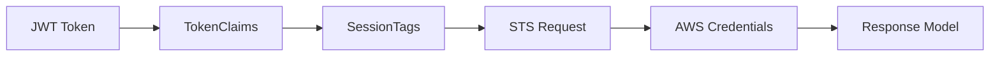
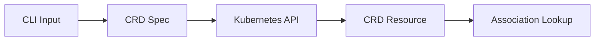
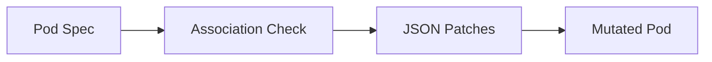

# Data Models and Structures

## Request/Response Models

### AssumeRoleForPodIdentityRequest
**Purpose**: Main API request structure
**Usage**: HTTP POST body for authentication endpoint

```java
public class AssumeRoleForPodIdentityRequest {
    private String clusterName;  // Required: EKS cluster identifier
    private String token;        // Required: Service account JWT token
}
```

**Validation Rules**:
- Both fields are required
- `clusterName` must be non-empty string
- `token` must be valid JWT format

### AssumeRoleForPodIdentityResponse
**Purpose**: Main API response structure
**Usage**: HTTP response body with AWS credentials

```java
public class AssumeRoleForPodIdentityResponse {
    private Subject subject;
    private String audience;
    private PodIdentityAssociation podIdentityAssociation;
    private AssumedRoleUser assumedRoleUser;
    private Credentials credentials;
}
```

#### Nested Response Structures

**Subject**:
```java
public class Subject {
    private String namespace;      // Kubernetes namespace
    private String serviceAccount; // Service account name
}
```

**PodIdentityAssociation**:
```java
public class PodIdentityAssociation {
    private String associationArn; // Generated association ARN
    private String associationId;  // Generated association ID
}
```

**AssumedRoleUser**:
```java
public class AssumedRoleUser {
    private String arn;           // Assumed role ARN
    private String assumeRoleId;  // STS assume role ID
}
```

**Credentials**:
```java
public class Credentials {
    private String accessKeyId;     // AWS access key
    private String secretAccessKey; // AWS secret key
    private String sessionToken;    // AWS session token
    private Instant expiration;     // Credential expiration time
}
```

## Custom Resource Definitions

### PodIdentityAssociation CRD
**Purpose**: Kubernetes custom resource for role associations
**API Group**: `eks.amazonaws.com/v1`

```yaml
apiVersion: apiextensions.k8s.io/v1
kind: CustomResourceDefinition
metadata:
  name: podidentityassociations.eks.amazonaws.com
spec:
  group: eks.amazonaws.com
  names:
    kind: PodIdentityAssociation
    plural: podidentityassociations
    singular: podidentityassociation
  scope: Namespaced
```

### PodIdentityAssociationSpec
**Purpose**: Specification schema for CRD instances

```java
public class PodIdentityAssociationSpec {
    private String clusterName;    // Required: EKS cluster name
    private String namespace;      // Required: Kubernetes namespace
    private String serviceAccount; // Required: Service account name
    private String roleArn;        // Required: AWS IAM role ARN
}
```

**OpenAPI Schema**:
```yaml
schema:
  openAPIV3Schema:
    type: object
    properties:
      spec:
        type: object
        properties:
          clusterName:
            type: string
            description: "EKS cluster name"
          namespace:
            type: string
            description: "Kubernetes namespace"
          serviceAccount:
            type: string
            description: "Service account name"
          roleArn:
            type: string
            description: "IAM role ARN to assume"
        required:
        - clusterName
        - namespace
        - serviceAccount
        - roleArn
```

## Internal Data Models

### TokenClaims
**Purpose**: JWT token claim extraction
**Usage**: Internal representation of service account token data

```java
public class TokenClaims {
    private String namespace;           // kubernetes.io/serviceaccount/namespace
    private String serviceAccount;      // kubernetes.io/serviceaccount/service-account.name
    private String serviceAccountUid;   // kubernetes.io/serviceaccount/service-account.uid
    private String podName;            // kubernetes.io/pod/name
    private String podUid;             // kubernetes.io/pod/uid
    private String subject;            // sub claim
    private Instant expiration;        // exp claim
}
```

**Claim Mapping**:
- Standard JWT claims: `sub`, `exp`, `aud`, `iss`
- Kubernetes-specific claims in `kubernetes.io` namespace
- Pod-specific metadata for session tagging

### Session Tags
**Purpose**: AWS STS session tag generation
**Usage**: Metadata attached to assumed role sessions

```java
Map<String, String> sessionTags = Map.of(
    "kubernetes.io/namespace", tokenClaims.getNamespace(),
    "kubernetes.io/serviceaccount/name", tokenClaims.getServiceAccount(),
    "kubernetes.io/pod/name", tokenClaims.getPodName(),
    "kubernetes.io/cluster/name", clusterName
);
```

## Configuration Data Models

### ConfigMap Structure
**Purpose**: Fallback role association mapping
**Format**: Key-value pairs in Kubernetes ConfigMap

```yaml
apiVersion: v1
kind: ConfigMap
metadata:
  name: pod-identity-associations
  namespace: kube-system
data:
  # Format: "cluster:namespace:serviceaccount" -> "role-arn"
  "my-cluster:default:my-app": "arn:aws:iam::123456789012:role/my-app-role"
  "my-cluster:ci-cd:*": "arn:aws:iam::123456789012:role/ci-cd-role"
```

**Key Pattern**: `{clusterName}:{namespace}:{serviceAccount}`
**Wildcard Support**: `*` in service account position matches any service account

### Application Configuration
**Purpose**: Quarkus application properties structure

```properties
# HTTP Configuration
quarkus.http.port=8080
quarkus.http.host=0.0.0.0

# EKS Pod Identity Configuration
eks.pod-identity.configmap.name=pod-identity-associations
eks.pod-identity.configmap.namespace=kube-system

# AWS STS Configuration
aws.sts.session-duration=PT1H

# JWT Validation Configuration
mp.jwt.verify.issuer=https://kubernetes.default.svc
mp.jwt.verify.publickey.location=https://kubernetes.default.svc/openid/v1/jwks
mp.jwt.verify.audiences=pods.eks.amazonaws.com
```

## Kubernetes Admission Webhook Models

### AdmissionReview Request
**Purpose**: Kubernetes admission controller input
**Usage**: Webhook receives this for pod mutation

```json
{
  "apiVersion": "admission.k8s.io/v1",
  "kind": "AdmissionReview",
  "request": {
    "uid": "request-uid",
    "kind": {"group": "", "version": "v1", "kind": "Pod"},
    "resource": {"group": "", "version": "v1", "resource": "pods"},
    "namespace": "default",
    "operation": "CREATE",
    "object": {
      // Complete Pod specification
    }
  }
}
```

### AdmissionReview Response
**Purpose**: Webhook response with mutations
**Usage**: Returns pod modifications as JSON patches

```json
{
  "apiVersion": "admission.k8s.io/v1",
  "kind": "AdmissionReview",
  "response": {
    "uid": "request-uid",
    "allowed": true,
    "patchType": "JSONPatch",
    "patch": "W3sib3AiOiJhZGQiLCJwYXRoIjoiL3NwZWMvY29udGFpbmVycy8wL2VudiIsInZhbHVlIjpbXX1d"
  }
}
```

### JSON Patch Operations
**Purpose**: Pod specification mutations
**Format**: RFC 6902 JSON Patch operations

```json
[
  {
    "op": "add",
    "path": "/spec/containers/0/env",
    "value": [
      {
        "name": "AWS_CONTAINER_CREDENTIALS_FULL_URI",
        "value": "http://eks-pod-identity-agent.kube-system:80/v1/credentials"
      }
    ]
  },
  {
    "op": "add",
    "path": "/spec/volumes",
    "value": [
      {
        "name": "aws-iam-token",
        "projected": {
          "sources": [
            {
              "serviceAccountToken": {
                "audience": "pods.eks.amazonaws.com",
                "expirationSeconds": 86400,
                "path": "token"
              }
            }
          ]
        }
      }
    ]
  }
]
```

## Error Response Models

### HTTP Error Response
**Purpose**: Standardized error format for REST API

```json
{
  "error": "string",      // Error type/category
  "message": "string",    // Human-readable error message
  "details": "string",    // Additional error context
  "timestamp": "string",  // ISO 8601 timestamp
  "path": "string"        // Request path that caused error
}
```

### CLI Error Output
**Purpose**: Command-line error reporting

```json
{
  "error": "ValidationError",
  "message": "Invalid role ARN format",
  "field": "roleArn",
  "value": "invalid-arn"
}
```

## Data Flow Patterns

### Authentication Flow Data


### CRD Management Flow Data


### Webhook Mutation Flow Data


## Validation Rules

### Input Validation
- **ClusterName**: Non-empty string, valid Kubernetes name format
- **Token**: Valid JWT format, non-expired
- **RoleArn**: Valid AWS ARN format, IAM role type
- **Namespace**: Valid Kubernetes namespace name
- **ServiceAccount**: Valid Kubernetes service account name

### Business Logic Validation
- Token audience must match configured audience
- Token must be issued by trusted Kubernetes cluster
- Role ARN must be assumable by the service
- Association must exist (CRD, ConfigMap, or default generation)
