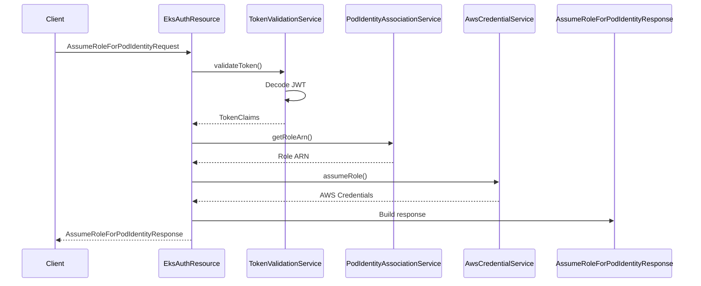

# Data Models

## Request Models

### AssumeRoleForPodIdentityRequest

Represents an AssumeRoleForPodIdentity API request.

```java
public class AssumeRoleForPodIdentityRequest {
    @JsonProperty("ClusterName")
    private String clusterName;
    
    @JsonProperty("Token")
    private String token;
    
    // Getters and setters
}
```

**Fields:**

| Field | Type | JSON Key | Description |
|-------|------|----------|-------------|
| clusterName | String | ClusterName | Name of the EKS cluster |
| token | String | Token | Kubernetes service account JWT token |

**Usage:**
- Sent by client applications to the EKS Auth Proxy
- Contains the cluster identifier and JWT token

## Response Models

### AssumeRoleForPodIdentityResponse

Main response model containing AWS credentials and metadata.

```java
public class AssumeRoleForPodIdentityResponse {
    @JsonProperty("Credentials")
    private Credentials credentials;
    
    @JsonProperty("AssumedRoleUser")
    private AssumedRoleUser assumedRoleUser;
    
    @JsonProperty("PodIdentityAssociation")
    private PodIdentityAssociation podIdentityAssociation;
    
    @JsonProperty("Subject")
    private Subject subject;
    
    @JsonProperty("Audience")
    private String audience;
    
    // Getters and setters
}
```

**Nested Classes:**

#### Credentials

AWS temporary credentials.

```java
public static class Credentials {
    @JsonProperty("AccessKeyId")
    private String accessKeyId;
    
    @JsonProperty("SecretAccessKey")
    private String secretAccessKey;
    
    @JsonProperty("SessionToken")
    private String sessionToken;
    
    @JsonProperty("Expiration")
    private Instant expiration;
    
    // Getters and setters
}
```

| Field | Type | JSON Key | Description |
|-------|------|----------|-------------|
| accessKeyId | String | AccessKeyId | AWS access key ID |
| secretAccessKey | String | SecretAccessKey | AWS secret access key |
| sessionToken | String | SessionToken | Session token |
| expiration | Instant | Expiration | Credential expiration time |

#### AssumedRoleUser

Information about the assumed role.

```java
public static class AssumedRoleUser {
    @JsonProperty("Arn")
    private String arn;
    
    @JsonProperty("AssumeRoleId")
    private String assumeRoleId;
    
    // Getters and setters
}
```

| Field | Type | JSON Key | Description |
|-------|------|----------|-------------|
| arn | String | Arn | Role ARN |
| assumeRoleId | String | AssumeRoleId | Session ID |

#### PodIdentityAssociation

Association metadata between Kubernetes and AWS.

```java
public static class PodIdentityAssociation {
    @JsonProperty("AssociationId")
    private String associationId;
    
    // Getters and setters
}
```

| Field | Type | JSON Key | Description |
|-------|------|----------|-------------|
| associationId | String | AssociationId | Unique association ID |

#### Subject

Token subject information.

```java
public static class Subject {
    @JsonProperty("Namespace")
    private String namespace;
    
    @JsonProperty("ServiceAccount")
    private String serviceAccount;
    
    // Getters and setters
}
```

| Field | Type | JSON Key | Description |
|-------|------|----------|-------------|
| namespace | String | Namespace | Kubernetes namespace |
| serviceAccount | String | ServiceAccount | Service account name |

## Token Claims

### TokenValidationService.TokenClaims

Internal model for decoded JWT claims.

```java
public static class TokenClaims {
    private final String namespace;
    private final String serviceAccount;
    private final String subject;
    
    // Getters only (immutable)
}
```

**Fields:**

| Field | Type | Source | Description |
|-------|------|--------|-------------|
| namespace | String | JWT claim | Kubernetes namespace |
| serviceAccount | String | JWT claim | Service account name |
| subject | String | JWT sub | Token subject |

## Data Flow

### Request to Response



### Token Structure

```
JWT Payload:
{
  "iss": "kubernetes/serviceaccount",
  "kubernetes.io/serviceaccount/namespace": "default",
  "kubernetes.io/serviceaccount/service-account.name": "my-sa",
  "sub": "system:serviceaccount:default:my-sa"
}
```

### ConfigMap Data Format

```
Key: cluster-name:namespace:serviceaccount
Value: arn:aws:iam::123456789012:role/role-name

Example:
Key: my-cluster:default:my-sa
Value: arn:aws:iam::123456789012:role/my-role
```
