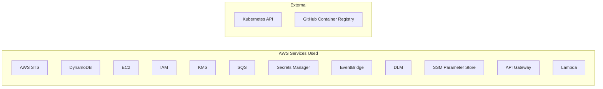

# Dependencies

## Core Framework

| Dependency | Version | Usage |
|-----------|---------|-------|
| Quarkus BOM | 3.37.1 | Application framework, DI, REST, Lambda |
| Quarkus Amazon Services BOM | 3.37.1 | AWS SDK integrations |

## AWS SDK v2

| Module | Service | Used By |
|--------|---------|---------|
| `software.amazon.awssdk:sts` | AWS STS | credential-service (AssumeRole) |
| `software.amazon.awssdk:dynamodb` | DynamoDB | credential, mgmt, tenant services |
| `software.amazon.awssdk:ec2` | EC2 | tenant-service (launch, EIP, SG, subnet) |
| `software.amazon.awssdk:iam` | IAM | tenant-service (roles, policies) |
| `software.amazon.awssdk:kms` | KMS | tenant-service (CA cert signing) |
| `software.amazon.awssdk:sqs` | SQS | tenant-service (progress + interruption queues) |
| `software.amazon.awssdk:secretsmanager` | Secrets Manager | tenant-service (SSH keys, PKI storage) |
| `software.amazon.awssdk:cloudwatchevents` | EventBridge | tenant-service (spot interruption rules) |
| `software.amazon.awssdk:dlm` | DLM | tenant-service (etcd backup policies) |
| `software.amazon.awssdk:ssm` | SSM | CLI (parameter resolution) |

## Security & Crypto

| Dependency | Usage |
|-----------|-------|
| `org.bitbucket.b_c:jose4j` | JWT/JWKS validation (credential + mgmt services) |
| `org.bouncycastle:bcpkix-jdk18on` | X.509 certificate generation (tenant-service) |

## Kubernetes

| Dependency | Usage |
|-----------|-------|
| `io.fabric8:kubernetes-client` | TokenReview (auth-proxy), K8s API (karpenter-support) |
| `io.fabric8:generator-annotations` | CRD model generation (karpenter-support) |

## Infrastructure

| Dependency | Usage |
|-----------|-------|
| `software.amazon.awscdk:aws-cdk-lib` | CDK stack definition (infra module) |
| `software.constructs:constructs` | CDK construct base (infra module) |

## CLI

| Dependency | Usage |
|-----------|-------|
| `info.picocli:picocli` | Command-line parsing (eks-dx CLI) |

## Build & Native

| Tool | Version | Purpose |
|------|---------|---------|
| Maven Surefire | 3.5.6 | Test execution |
| Maven Compiler | 3.15.0 | Java 25 compilation |
| Mandrel Builder | JDK 25 | GraalVM native image builds |

## Test Dependencies

| Dependency | Usage |
|-----------|-------|
| `io.quarkus:quarkus-junit5` | Quarkus test framework |
| `io.rest-assured:rest-assured` | REST API testing |
| `org.mockito:mockito-core` | Mocking |
| Robot Framework | UAT acceptance tests |
| Python mock server | HTTP mock for CLI tests |

## External Services (Runtime)

