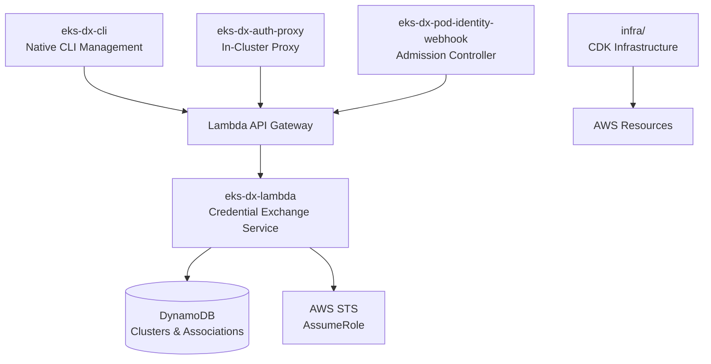
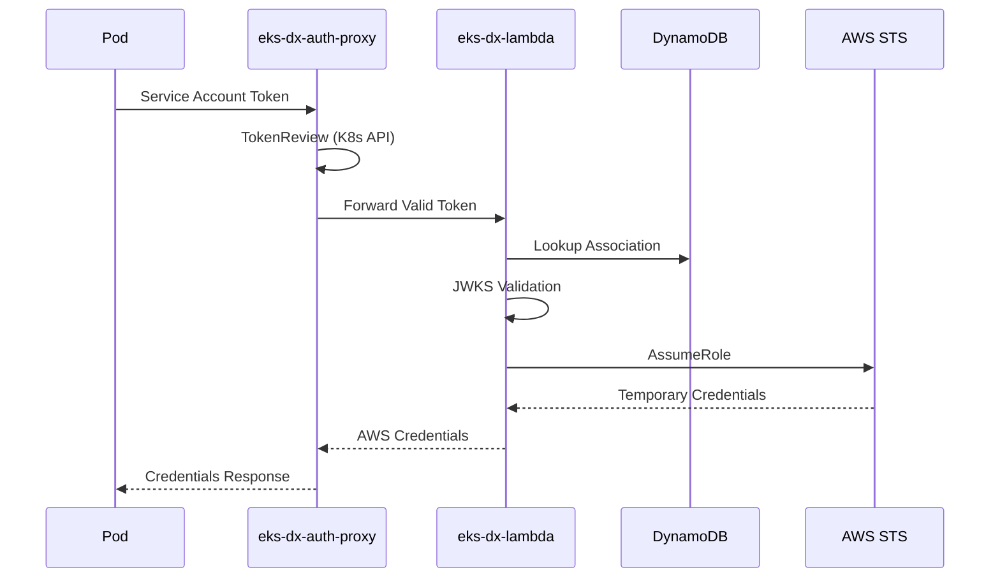

# EKS-DX Control Plane Documentation Index

This is the primary knowledge base index for AI assistants working with the EKS-DX Control Plane codebase. Use this file to understand the documentation structure and locate relevant information efficiently.

## How to Use This Documentation

**For AI Assistants**: This index contains sufficient metadata to answer most questions about the codebase. Each section below describes what information is available and which files contain detailed content. Only read specific documentation files when you need deep technical details not summarized here.

**Quick Navigation**: Use the component map and entry points below to locate relevant code without reading every file.

## Documentation Files Overview

| File | Purpose | When to Use |
|------|---------|-------------|
| `codebase_info.md` | Basic codebase statistics and structure | Understanding project scale and organization |
| `architecture.md` | System architecture and design patterns | Architectural decisions and component relationships |
| `components.md` | Major components and responsibilities | Understanding what each module does |
| `interfaces.md` | APIs, interfaces, and integration points | API contracts and external integrations |
| `data_models.md` | Data structures and models | Database schemas and data flow |
| `workflows.md` | Key processes and authentication flows | Understanding business logic and user journeys |
| `dependencies.md` | External dependencies and usage | Technology stack and third-party integrations |
| `review_notes.md` | Documentation quality assessment | Areas needing attention or improvement |

## Project Overview

**EKS-DX Control Plane** is a multi-module Quarkus + CDK project that replicates AWS EKS Pod Identity authentication for local development and CI/CD environments. It enables k3s, microk8s, and EKS-D clusters to use AWS IAM roles for pod authentication through a serverless Lambda backend.

### Key Statistics
- **Total Files**: 1,562
- **Prioritized Files**: 68 (core business logic)
- **Lines of Code**: 6,485
- **Programming Language**: Java 21
- **Architecture**: Microservices with serverless backend

### Technology Stack
- **Framework**: Quarkus (native compilation support)
- **Infrastructure**: AWS CDK + SAM templates
- **Database**: DynamoDB (clusters and associations)
- **Authentication**: JWT/JWKS validation with jose4j
- **Container Runtime**: Docker + GraalVM native images
- **Build System**: Maven multi-module

## Component Map

### Core Modules



### Directory Structure
```
├── eks-dx-lambda/           # 🔑 Core credential exchange service
├── eks-dx-cli/              # 🛠️ Management CLI (native binary)
├── eks-dx-auth-proxy/          # 🔄 In-cluster authentication proxy
├── eks-dx-pod-identity-webhook/ # ⚡ Kubernetes admission webhook
├── infra/                   # 🏗️ CDK infrastructure definitions
├── sam.yaml                 # 📋 SAM deployment template
└── docs/                    # 📚 User guides and setup scripts
```

## Key Entry Points

### Authentication Flow Entry Points
| Component | File | Purpose |
|-----------|------|---------|
| **Credential Exchange** | `eks-dx-lambda/.../EksAuthResource.java` | Main API endpoint for pod authentication |
| **Token Validation** | `eks-dx-lambda/.../JwksTokenValidationService.java` | JWT signature verification |
| **In-Cluster Proxy** | `eks-dx-auth-proxy/.../EksAuthAgentResource.java` | Fast-fail token validation + forwarding |
| **Webhook Controller** | `eks-dx-pod-identity-webhook/.../WebhookEndpoint.java` | Pod mutation for identity injection |

### Management API Entry Points
| Component | File | Purpose |
|-----------|------|---------|
| **Cluster Management** | `eks-dx-lambda/.../ClusterResource.java` | CRUD operations for cluster registration |
| **Association Management** | `eks-dx-lambda/.../AssociationResource.java` | Pod identity association management |
| **CLI Commands** | `eks-dx-cli/.../EksDxCommand.java` | Command-line interface entry point |

### Infrastructure Entry Points
| Component | File | Purpose |
|-----------|------|---------|
| **CDK Stack** | `infra/.../EksDxStack.java` | Complete AWS infrastructure definition |
| **SAM Template** | `sam.yaml` | Alternative serverless deployment |

## Authentication Flow Summary



## Repository-Specific Patterns

### Build System
- **Multi-module Maven**: Each component builds independently
- **Native Compilation**: CLI uses GraalVM for native binaries
- **Container Images**: Quarkus container-image extension
- **Integration Tests**: DynamoDB Local on port 18000

### Configuration Management
- **CLI Config**: `~/.eks-dx/config` (endpoint, region)
- **Environment Variables**: Component-specific env var patterns
- **Property Files**: Quarkus application.properties per module

### Testing Strategy
- **Unit Tests**: 192 total across all modules
- **Integration Tests**: 16 tests with DynamoDB Local
- **Mock Servers**: WireMock for external API testing
- **Test Coverage**: Focused on service layer and API contracts

### Security Patterns
- **JWT Validation**: jose4j library with JWKS caching
- **AWS SigV4**: Custom implementation for CLI authentication
- **Token Audience**: Strict audience validation (`pods.eks.amazonaws.com`)
- **Session Tags**: Kubernetes metadata propagated to AWS

## Development Workflow

### Local Development
```bash
# Lambda development
mvn -pl eks-dx-lambda compile quarkus:dev

# CLI development  
mvn -pl eks-dx-cli package -Pnative

# Integration testing
docker run -d -p 18000:8000 public.ecr.aws/aws-dynamodb-local/aws-dynamodb-local:latest
mvn test -Dintegration.dynamodb=true
```

### Deployment Options
- **SAM**: `sam deploy --guided` (recommended for AWS)
- **CDK**: `cd infra && cdk deploy` (infrastructure as code)
- **Container**: Docker images for proxy and webhook components

## Custom Instructions
<!-- This section is for human and agent-maintained operational knowledge.
     Add repo-specific conventions, gotchas, and workflow rules here.
     This section is preserved exactly as-is when re-running codebase-summary. -->
