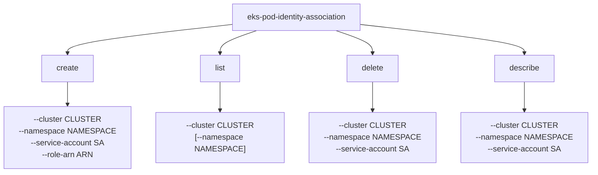

# APIs and Interfaces

## REST API Endpoints

### Main Authentication Endpoint

#### POST /
**Purpose**: AssumeRoleForPodIdentity - Main authentication endpoint

**Request Format**:
```json
{
  "ClusterName": "string",
  "Token": "string"
}
```

**Response Format**:
```json
{
  "Subject": {
    "Namespace": "string",
    "ServiceAccount": "string"
  },
  "Audience": "string",
  "PodIdentityAssociation": {
    "AssociationArn": "string",
    "AssociationId": "string"
  },
  "AssumedRoleUser": {
    "Arn": "string",
    "AssumeRoleId": "string"
  },
  "Credentials": {
    "AccessKeyId": "string",
    "SecretAccessKey": "string",
    "SessionToken": "string",
    "Expiration": "2023-01-01T00:00:00Z"
  }
}
```

**HTTP Status Codes**:
- `200 OK`: Successful authentication
- `400 Bad Request`: Invalid request format or token validation failure
- `500 Internal Server Error`: AWS STS failure or internal error

### Health Check Endpoints

#### GET /health/live
**Purpose**: Kubernetes liveness probe
**Response**: `200 OK` if service is running

#### GET /health/ready
**Purpose**: Kubernetes readiness probe
**Response**: `200 OK` if service is ready to handle requests

### Metrics Endpoint

#### GET /metrics
**Purpose**: Prometheus metrics export
**Format**: Prometheus text format
**Metrics**: HTTP request metrics, JVM metrics, custom business metrics

## Kubernetes Admission Webhook API

### Webhook Endpoint

#### POST /mutate
**Purpose**: Kubernetes admission webhook for pod mutation

**Request Format** (Kubernetes AdmissionReview):
```json
{
  "apiVersion": "admission.k8s.io/v1",
  "kind": "AdmissionReview",
  "request": {
    "uid": "string",
    "kind": {"group": "", "version": "v1", "kind": "Pod"},
    "resource": {"group": "", "version": "v1", "resource": "pods"},
    "object": {
      // Pod specification
    }
  }
}
```

**Response Format** (AdmissionReview):
```json
{
  "apiVersion": "admission.k8s.io/v1",
  "kind": "AdmissionReview",
  "response": {
    "uid": "string",
    "allowed": true,
    "patchType": "JSONPatch",
    "patch": "base64-encoded-json-patch"
  }
}
```

**Mutation Logic**:
- Injects AWS credential environment variables
- Adds service account token volume mounts
- Only applies to pods with associated service accounts

## CLI Interface

### Command Structure



### CLI Commands

#### create
**Purpose**: Create a new pod identity association
**Parameters**:
- `--cluster`: EKS cluster name (required)
- `--namespace`: Kubernetes namespace (required)
- `--service-account`: Service account name (required)
- `--role-arn`: AWS IAM role ARN (required)

**Example**:
```bash
eks-pod-identity-association create \
  --cluster my-cluster \
  --namespace default \
  --service-account my-app \
  --role-arn arn:aws:iam::123456789012:role/my-app-role
```

#### list
**Purpose**: List existing pod identity associations
**Parameters**:
- `--cluster`: EKS cluster name (required)
- `--namespace`: Filter by namespace (optional)

**Example**:
```bash
eks-pod-identity-association list --cluster my-cluster
```

#### delete
**Purpose**: Delete a pod identity association
**Parameters**:
- `--cluster`: EKS cluster name (required)
- `--namespace`: Kubernetes namespace (required)
- `--service-account`: Service account name (required)

#### describe
**Purpose**: Show detailed information about an association
**Parameters**: Same as delete command

## Kubernetes Custom Resource API

### PodIdentityAssociation CRD

**API Version**: `eks.amazonaws.com/v1`
**Kind**: `PodIdentityAssociation`
**Scope**: Namespaced

**Resource Specification**:
```yaml
apiVersion: eks.amazonaws.com/v1
kind: PodIdentityAssociation
metadata:
  name: my-app-association
  namespace: default
spec:
  clusterName: "my-cluster"
  namespace: "default"
  serviceAccount: "my-app"
  roleArn: "arn:aws:iam::123456789012:role/my-app-role"
```

**Field Validation**:
- All spec fields are required
- `roleArn` must be valid AWS ARN format
- `clusterName`, `namespace`, `serviceAccount` must be valid Kubernetes names

## External API Integrations

### Kubernetes API Integration

#### TokenReview API
**Purpose**: JWT token validation
**Endpoint**: `POST /api/v1/tokenreviews`
**Usage**: Validates service account tokens

**Request**:
```json
{
  "apiVersion": "authentication.k8s.io/v1",
  "kind": "TokenReview",
  "spec": {
    "token": "eyJ...",
    "audiences": ["pods.eks.amazonaws.com"]
  }
}
```

#### Custom Resource API
**Purpose**: CRD resource management
**Endpoints**: Standard Kubernetes resource API patterns
**Operations**: GET, POST, PUT, DELETE on PodIdentityAssociation resources

### AWS API Integration

#### EKS API
**Purpose**: Pod identity association lookup (fallback to local CRDs)
**Operations**:
- `ListPodIdentityAssociations`
- `DescribePodIdentityAssociation`

#### STS API
**Purpose**: Temporary credential generation
**Operation**: `AssumeRole`

**Request Parameters**:
- `RoleArn`: Target IAM role
- `RoleSessionName`: Generated session identifier
- `DurationSeconds`: Session duration (default 3600)
- `Tags`: Session tags from token claims

## Configuration Interfaces

### Environment Variables

| Variable | Purpose | Default |
|----------|---------|---------|
| `AWS_ACCOUNT_ID` | Fallback role ARN generation | - |
| `AWS_ACCESS_KEY_ID` | AWS credentials | - |
| `AWS_SECRET_ACCESS_KEY` | AWS credentials | - |
| `AWS_REGION` | AWS region | `us-east-1` |
| `AWS_CONTAINER_CREDENTIALS_FULL_URI` | EKS Pod Identity Agent integration | - |

### Application Properties

| Property | Purpose | Default |
|----------|---------|---------|
| `quarkus.http.port` | HTTP server port | `8080` |
| `eks.pod-identity.configmap.name` | ConfigMap fallback name | `pod-identity-associations` |
| `eks.pod-identity.configmap.namespace` | ConfigMap namespace | `kube-system` |
| `aws.sts.session-duration` | STS session duration | `PT1H` |

### ConfigMap Fallback Format

**ConfigMap Structure**:
```yaml
apiVersion: v1
kind: ConfigMap
metadata:
  name: pod-identity-associations
  namespace: kube-system
data:
  "cluster:namespace:serviceaccount": "arn:aws:iam::account:role/role-name"
  "cluster:namespace:*": "arn:aws:iam::account:role/wildcard-role"
```

**Key Format**: `{clusterName}:{namespace}:{serviceAccount}`
**Wildcard Support**: `*` for service account matches any service account in namespace

## Error Handling

### HTTP Error Responses

**400 Bad Request**:
```json
{
  "error": "Token validation failed",
  "details": "Invalid audience"
}
```

**500 Internal Server Error**:
```json
{
  "error": "AWS STS failure",
  "details": "Unable to assume role"
}
```

### CLI Error Handling
- Exit codes: 0 (success), 1 (error)
- Error messages to stderr
- Structured error output for parsing

### Webhook Error Handling
- Admission review responses with error details
- Fallback to allow pods without associations
- Logging for troubleshooting
