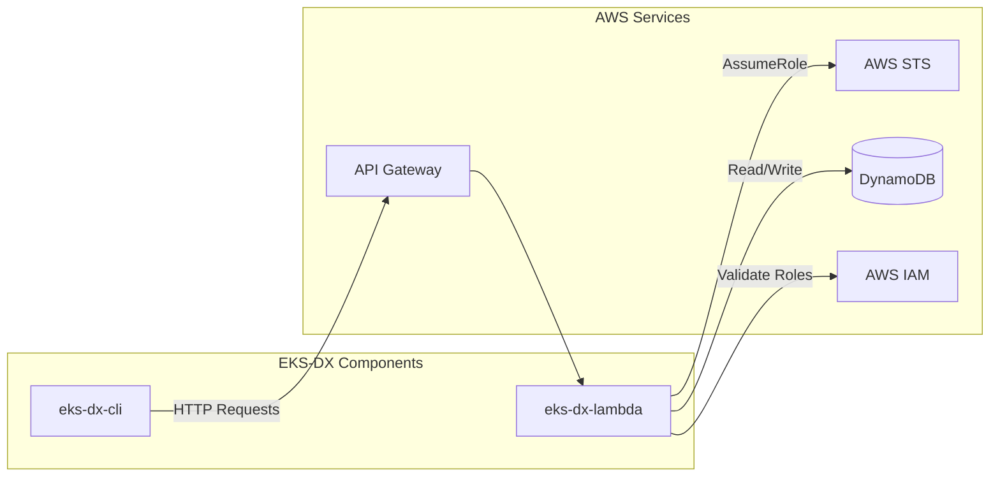
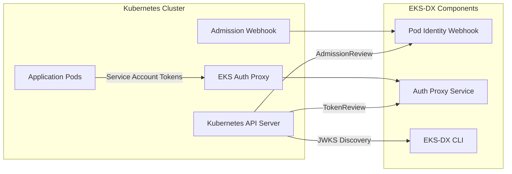

# Interfaces and Integration Points

## API Interfaces

### EKS-DX Lambda REST API

The core Lambda service exposes RESTful endpoints for both authentication and management operations.

#### Authentication Endpoint
```http
POST /clusters/{clusterName}/assets
Content-Type: application/json
Authorization: Bearer <service-account-token>

{
  "ClusterName": "my-cluster",
  "Token": "eyJ..."
}
```

**Response:**
```json
{
  "Subject": {
    "Namespace": "default",
    "ServiceAccount": "my-sa",
    "PodName": "my-pod-123",
    "PodUid": "abc-def-123"
  },
  "AssumedRoleUser": {
    "Arn": "arn:aws:sts::123456789012:assumed-role/MyRole/session",
    "AssumedRoleId": "AROABC123:session"
  },
  "Credentials": {
    "AccessKeyId": "ASIA...",
    "SecretAccessKey": "...",
    "SessionToken": "...",
    "Expiration": "2024-01-01T12:00:00Z"
  }
}
```

#### Management Endpoints

**Cluster Management:**
```http
# Register cluster
POST /clusters
Authorization: AWS4-HMAC-SHA256 ...

# List clusters  
GET /clusters

# Describe cluster
GET /clusters/{name}

# Update cluster JWKS
PUT /clusters/{name}/jwks

# Deregister cluster
DELETE /clusters/{name}
```

**Association Management:**
```http
# Create association
POST /clusters/{clusterName}/associations
Authorization: AWS4-HMAC-SHA256 ...

# List associations
GET /clusters/{clusterName}/associations?namespace=default&serviceAccount=my-sa

# Describe association
GET /clusters/{clusterName}/associations/{associationId}

# Delete association
DELETE /clusters/{clusterName}/associations/{associationId}
```

### EKS Auth Proxy Interface

The in-cluster proxy mimics the AWS EKS Pod Identity Agent API.

```http
POST /
Content-Type: application/json

{
  "ClusterName": "my-cluster", 
  "Token": "eyJ..."
}
```

### Pod Identity Webhook Interface

Kubernetes admission webhook following the standard admission controller protocol.

```http
POST /mutate
Content-Type: application/json

{
  "kind": "AdmissionReview",
  "apiVersion": "admission.k8s.io/v1",
  "request": {
    "object": {
      "kind": "Pod",
      "spec": {...}
    }
  }
}
```

## External System Integrations

### AWS Services Integration



#### AWS STS Integration
- **AssumeRole API**: Exchange validated tokens for temporary credentials
- **Session Tags**: Propagate Kubernetes metadata to AWS sessions
- **Session Duration**: Configurable credential lifetime (default: 1 hour)

#### DynamoDB Integration
- **Clusters Table**: Store cluster registration and JWKS data
- **Associations Table**: Store pod identity associations
- **Query Patterns**: Efficient lookups by cluster name and association keys

#### AWS IAM Integration
- **Role Validation**: Verify IAM role existence and trust policies
- **Trust Policy Checking**: Ensure roles can be assumed by the service
- **Permission Boundaries**: Support for IAM permission boundaries

### Kubernetes Integration



#### Kubernetes API Server Integration
- **TokenReview API**: Validate service account token signatures
- **JWKS Endpoint**: Discover public keys for token validation
- **Admission Webhooks**: Register pod mutation webhook

#### Service Account Token Integration
- **Projected Tokens**: Use projected service account tokens with custom audience
- **Token Audience**: Validate audience matches `pods.eks.amazonaws.com`
- **Token Claims**: Extract namespace, service account, pod metadata

## Data Interfaces

### DynamoDB Schema

#### Clusters Table
```json
{
  "PK": "CLUSTER#cluster-name",
  "SK": "METADATA",
  "Name": "cluster-name",
  "Issuer": "https://kubernetes.default.svc.cluster.local",
  "Jwks": "{\"keys\":[...]}",
  "CreatedAt": "2024-01-01T00:00:00Z",
  "UpdatedAt": "2024-01-01T00:00:00Z"
}
```

#### Associations Table
```json
{
  "PK": "CLUSTER#cluster-name",
  "SK": "ASSOCIATION#namespace#service-account",
  "AssociationId": "uuid-1234",
  "ClusterName": "cluster-name",
  "Namespace": "default",
  "ServiceAccount": "my-service-account",
  "RoleArn": "arn:aws:iam::123456789012:role/MyRole",
  "CreatedAt": "2024-01-01T00:00:00Z"
}
```

### JWT Token Structure

#### Service Account Token Claims
```json
{
  "iss": "https://kubernetes.default.svc.cluster.local",
  "aud": ["pods.eks.amazonaws.com"],
  "sub": "system:serviceaccount:namespace:service-account",
  "exp": 1704067200,
  "iat": 1704063600,
  "kubernetes.io": {
    "namespace": "default",
    "serviceaccount": {
      "name": "my-service-account",
      "uid": "abc-def-123"
    },
    "pod": {
      "name": "my-pod-123",
      "uid": "def-ghi-456"
    }
  }
}
```

## Configuration Interfaces

### CLI Configuration
```yaml
# ~/.eks-dx/config
endpoint: https://api.eks-dx.plasticity.cloud
region: us-east-1
```

### Environment Variables Interface
| Variable | Component | Purpose |
|----------|-----------|---------|
| `EKS_DX_ENDPOINT` | eks-dx-auth-proxy, webhook | Lambda API Gateway URL |
| `EKS_CLUSTER_NAME` | webhook | Cluster name for association lookups |
| `AWS_REGION` | All components | AWS region for API calls |
| `eks-dx.clusters-table` | eks-dx-lambda | DynamoDB clusters table name |
| `eks-dx.associations-table` | eks-dx-lambda | DynamoDB associations table name |

### Quarkus Configuration Interface
```properties
# application.properties
eks-dx.clusters-table=eks-dx-clusters
eks-dx.associations-table=eks-dx-associations
aws.sts.session-duration=PT1H
quarkus.http.port=8080
```

## Security Interfaces

### Authentication Methods
- **Service Account Tokens**: Kubernetes-issued JWT tokens
- **AWS SigV4**: CLI authentication to management API
- **IAM Roles**: AWS credential exchange mechanism

### Authorization Patterns
- **Token Audience Validation**: Strict audience checking
- **Association-Based Access**: Role mapping through associations
- **Session Tagging**: Kubernetes metadata in AWS sessions

### Network Security
- **HTTPS Only**: All external communications encrypted
- **Internal Cluster**: Proxy and webhook communicate within cluster
- **API Gateway**: Managed TLS termination for Lambda API
