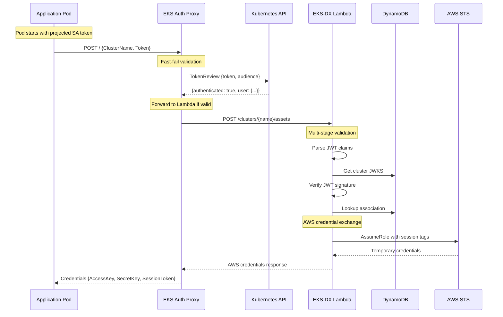
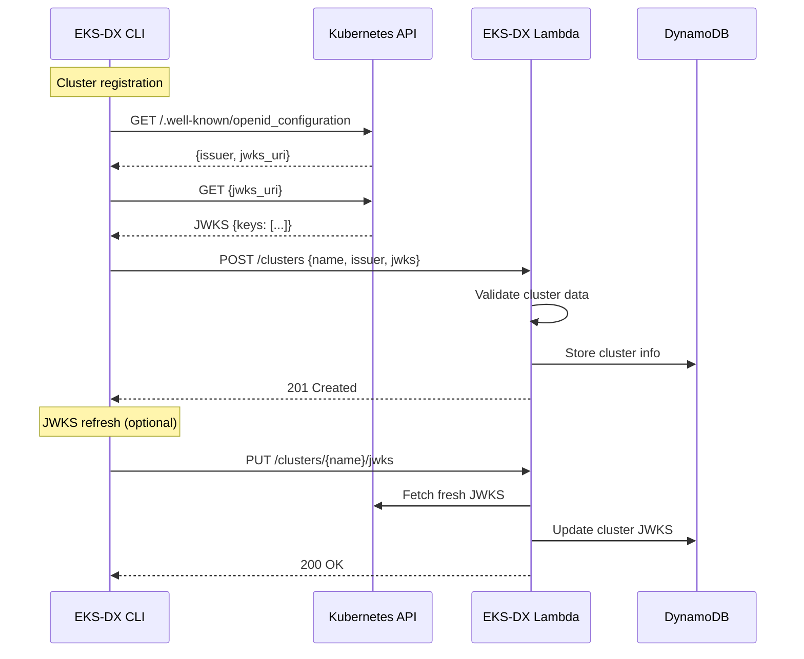
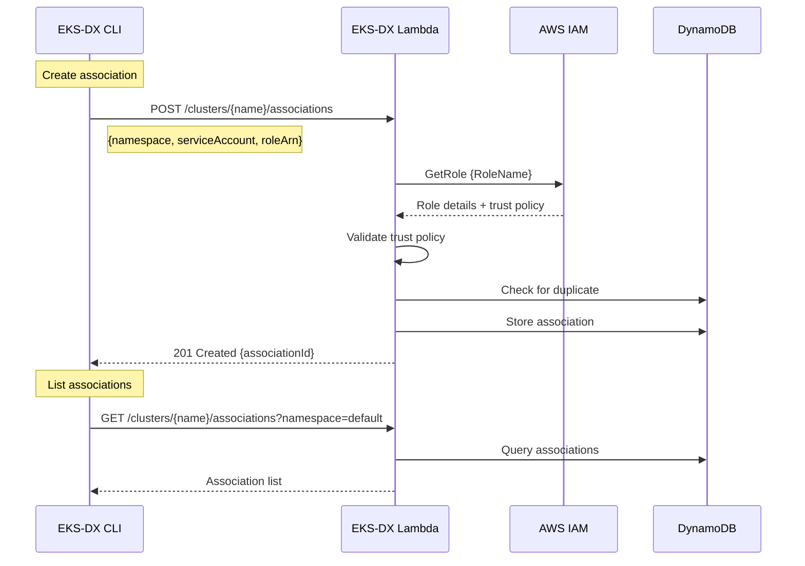
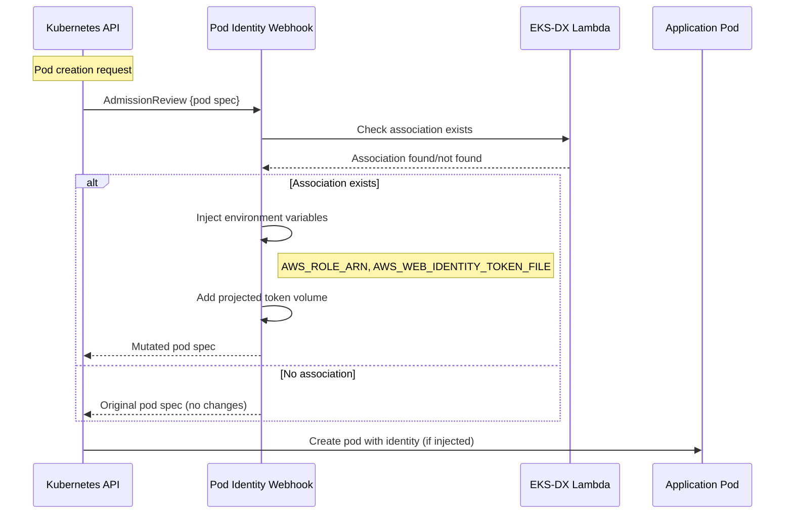
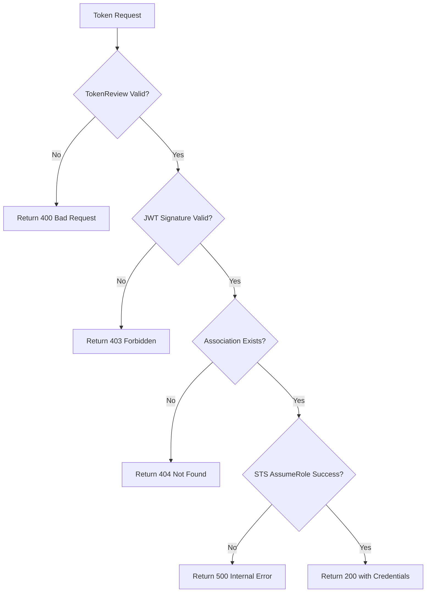
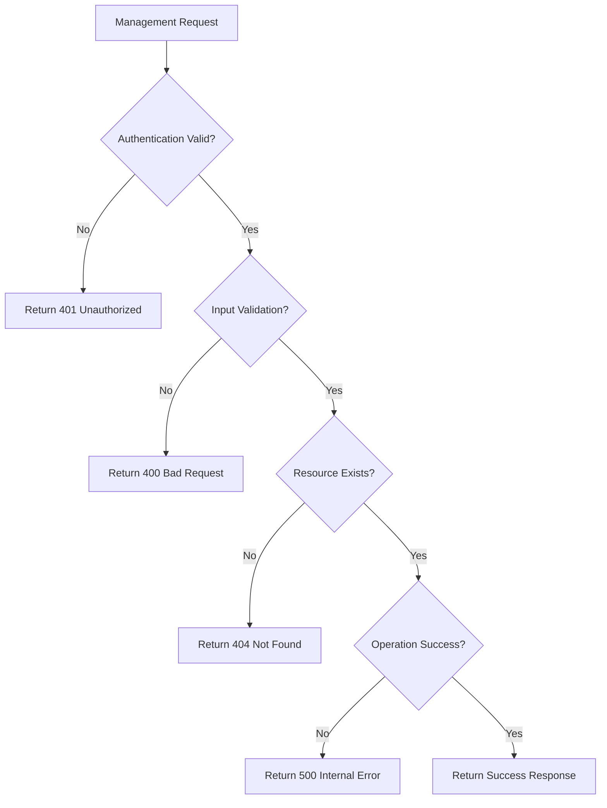
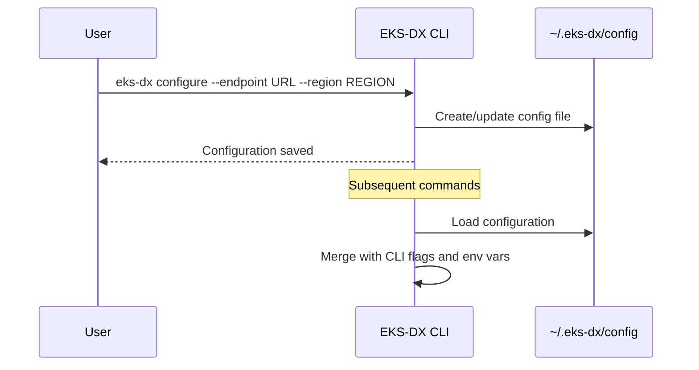
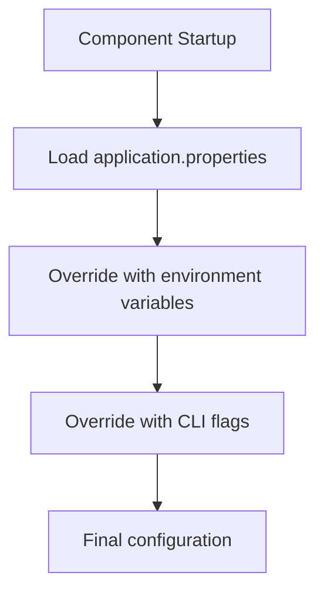
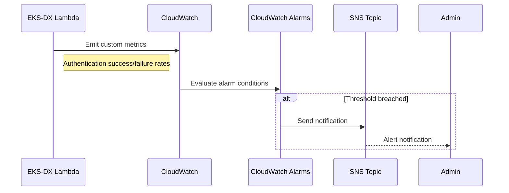
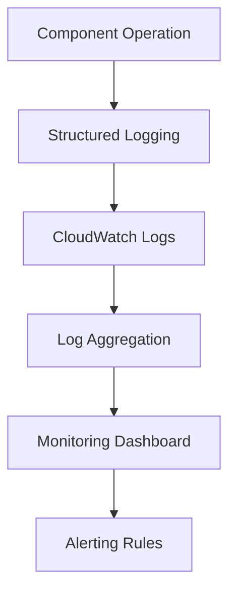

# Key Workflows and Processes

## Authentication Workflow

The core authentication workflow enables Kubernetes pods to obtain AWS credentials using service account tokens.



### Authentication Steps

1. **Token Acquisition**: Pod uses projected service account token with audience `pods.eks.amazonaws.com`
2. **Proxy Validation**: EKS Auth Proxy performs TokenReview with Kubernetes API for fast-fail
3. **Token Forwarding**: Valid tokens are forwarded to Lambda service
4. **JWT Validation**: Lambda validates JWT signature using cached JWKS
5. **Association Lookup**: Lambda queries DynamoDB for pod identity association
6. **Credential Exchange**: Lambda calls STS AssumeRole with Kubernetes metadata as session tags
7. **Response**: AWS credentials returned to pod for use with AWS SDKs

## Cluster Management Workflow

Cluster registration enables the system to validate tokens from specific Kubernetes clusters.



### Cluster Management Steps

1. **OIDC Discovery**: CLI discovers OIDC configuration from Kubernetes API
2. **JWKS Retrieval**: CLI fetches JSON Web Key Set for token validation
3. **Registration**: CLI registers cluster with Lambda service
4. **Validation**: Lambda validates cluster data and stores in DynamoDB
5. **JWKS Refresh**: Periodic JWKS updates to handle key rotation

## Association Management Workflow

Pod identity associations map Kubernetes service accounts to AWS IAM roles.



### Association Management Steps

1. **Role Validation**: Lambda validates IAM role exists and has proper trust policy
2. **Duplicate Check**: Lambda ensures no duplicate associations exist
3. **Storage**: Association stored in DynamoDB with generated ID
4. **Querying**: Associations can be filtered by namespace and service account

## Pod Identity Injection Workflow

The admission webhook automatically injects identity configuration into pods.



### Pod Injection Steps

1. **Admission Review**: Kubernetes sends pod creation request to webhook
2. **Association Check**: Webhook queries Lambda for existing association
3. **Conditional Mutation**: Pod is mutated only if association exists
4. **Environment Injection**: AWS_ROLE_ARN and AWS_WEB_IDENTITY_TOKEN_FILE added
5. **Volume Mounting**: Projected service account token volume mounted

## Error Handling Workflows

### Authentication Error Flow


### Management Error Flow


## Configuration Workflows

### CLI Configuration Setup


### Environment Variable Resolution


## Monitoring and Observability Workflows

### CloudWatch Metrics Flow


### Logging Workflow


## Deployment Workflows

### SAM Deployment
```bash
# Build and deploy workflow
mvn -pl eks-dx-lambda package -DskipTests
sam validate
sam deploy --guided
```

### CDK Deployment
```bash
# Infrastructure as Code workflow
mvn -pl eks-dx-lambda package -DskipTests
cd infra
cdk bootstrap  # First time only
cdk deploy
```

### Container Deployment
```bash
# Build container images
mvn -pl eks-dx-auth-proxy package -DskipTests \
  -Dquarkus.container-image.build=true

mvn -pl eks-dx-pod-identity-webhook package -DskipTests \
  -Dquarkus.container-image.build=true

# Deploy to Kubernetes
kubectl apply -f k8s-manifests/
```

## Testing Workflows

### Unit Testing
```bash
# Run all unit tests
mvn test

# Run specific module tests
mvn -pl eks-dx-lambda test
```

### Integration Testing
```bash
# Start DynamoDB Local
docker run -d -p 18000:8000 \
  public.ecr.aws/aws-dynamodb-local/aws-dynamodb-local:latest

# Run integration tests
mvn -pl eks-dx-lambda test \
  -Dtest=DynamoDbIntegrationTest \
  -Dintegration.dynamodb=true
```

### End-to-End Testing
```bash
# Full integration test with real AWS resources
mvn -pl eks-dx-auth-proxy test \
  -Dintegration.aws=true \
  -Dintegration.cluster=my-cluster \
  -Daws.region=us-east-1
```
