# Workflows and Processes

## Core Authentication Workflow

The main authentication process follows a four-step validation pattern that mirrors the AWS EKS Auth Service behavior.

### Primary Authentication Flow

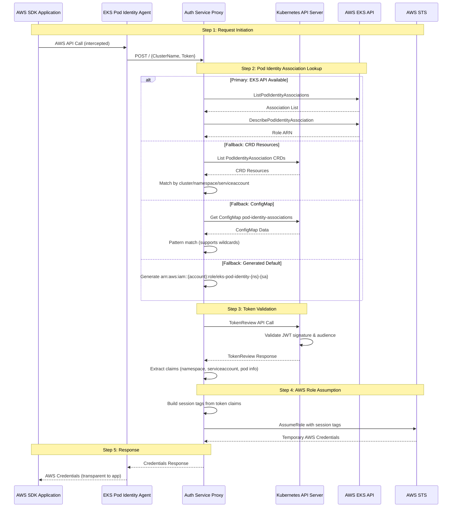

### Fallback Strategy Details

The system implements a robust fallback strategy for role association lookup:

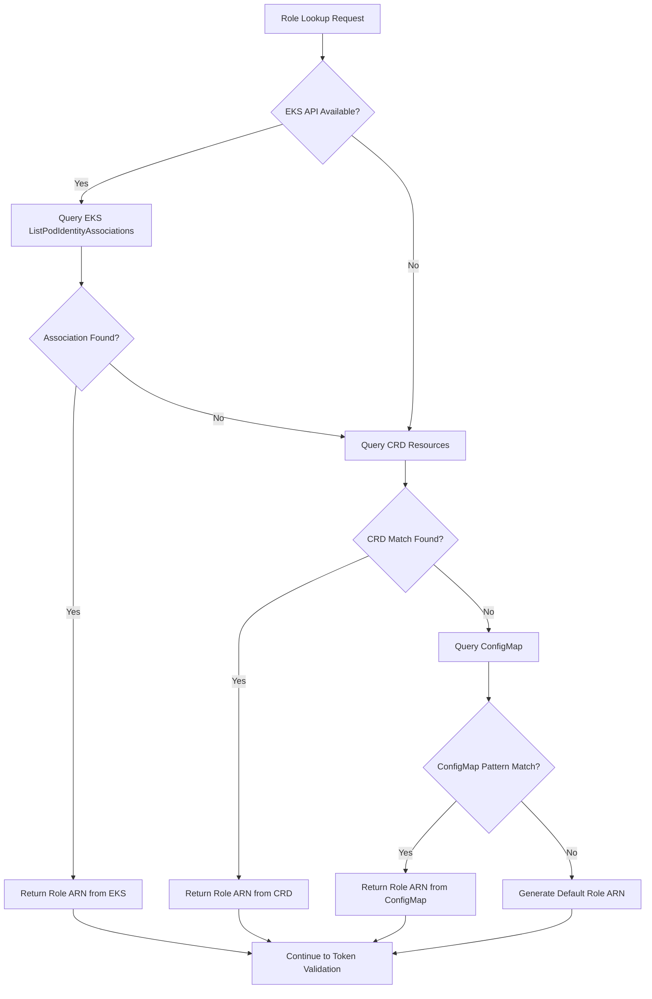

## CLI Management Workflows

### Association Creation Workflow

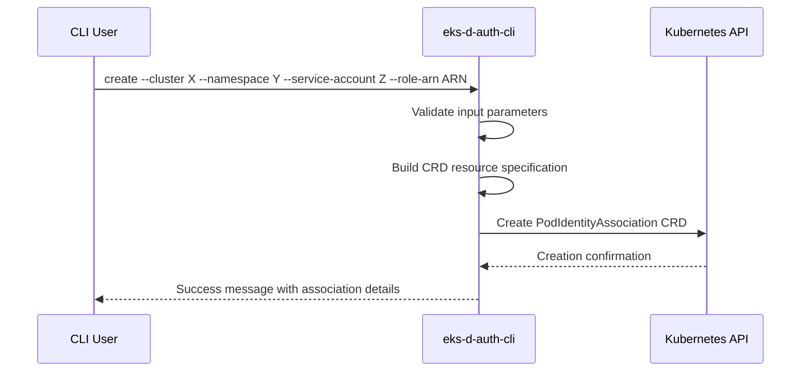

### Association Listing Workflow

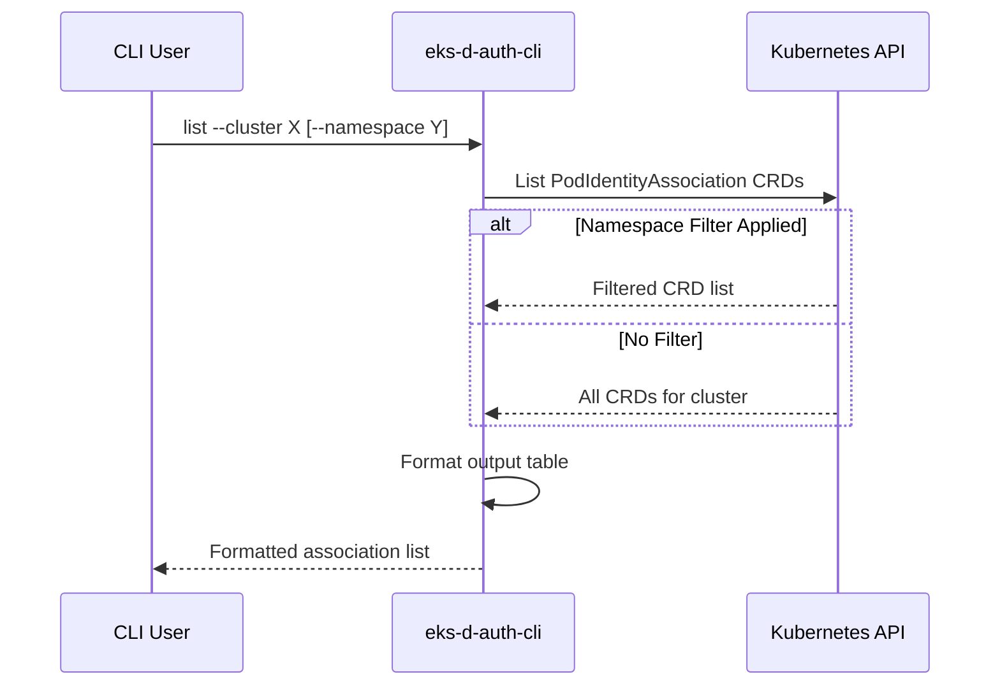

## Webhook Mutation Workflow

### Pod Admission Process

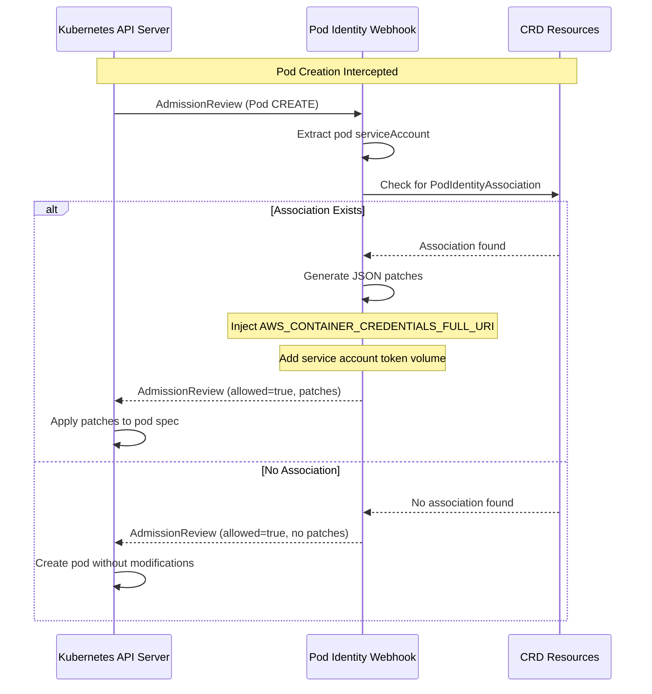

### Mutation Details

The webhook applies specific mutations to pods with associated service accounts:

**Environment Variable Injection**:
```yaml
env:
- name: AWS_CONTAINER_CREDENTIALS_FULL_URI
  value: "http://eks-pod-identity-agent.kube-system:80/v1/credentials"
- name: AWS_CONTAINER_AUTHORIZATION_TOKEN_FILE
  value: "/var/run/secrets/pods.eks.amazonaws.com/serviceaccount/token"
```

**Volume and Volume Mount Injection**:
```yaml
volumes:
- name: aws-iam-token
  projected:
    sources:
    - serviceAccountToken:
        audience: pods.eks.amazonaws.com
        expirationSeconds: 86400
        path: token

volumeMounts:
- name: aws-iam-token
  mountPath: /var/run/secrets/pods.eks.amazonaws.com/serviceaccount
  readOnly: true
```

## Build and Deployment Workflows

### Multi-Module Build Process

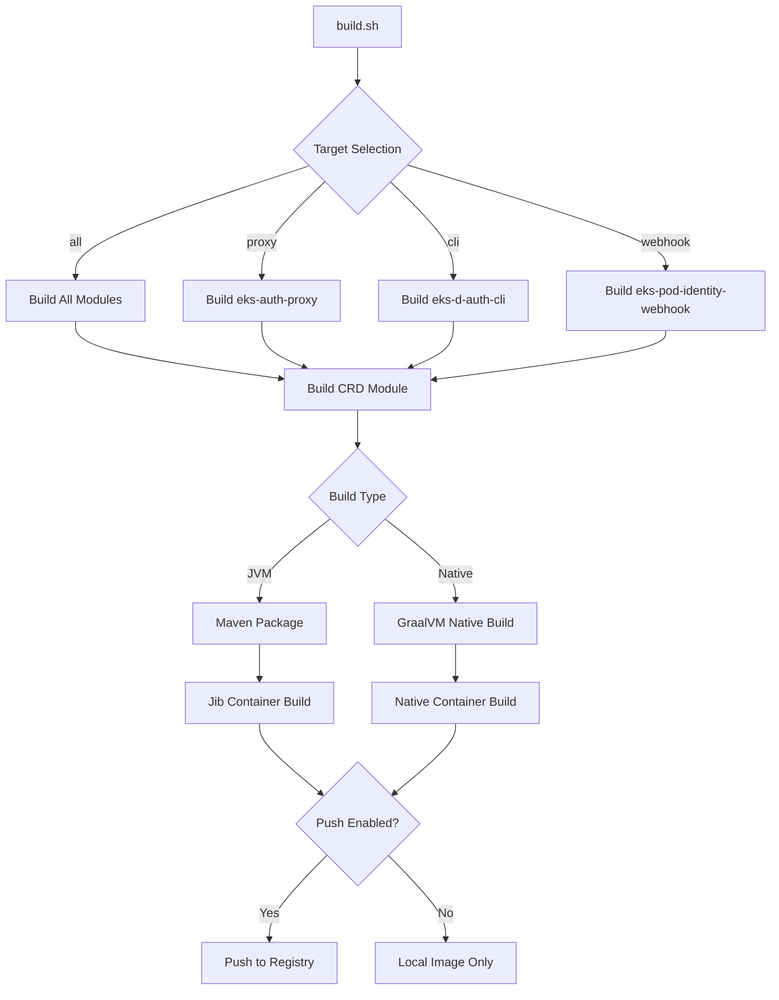

### Deployment Process

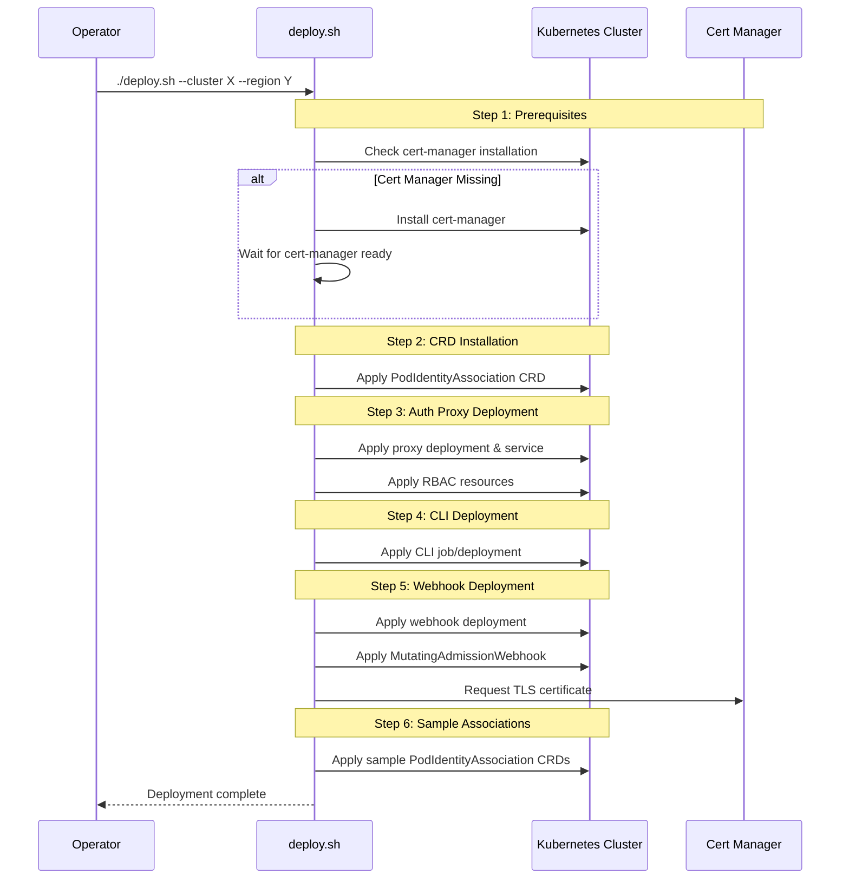

## Error Handling Workflows

### Authentication Error Flow

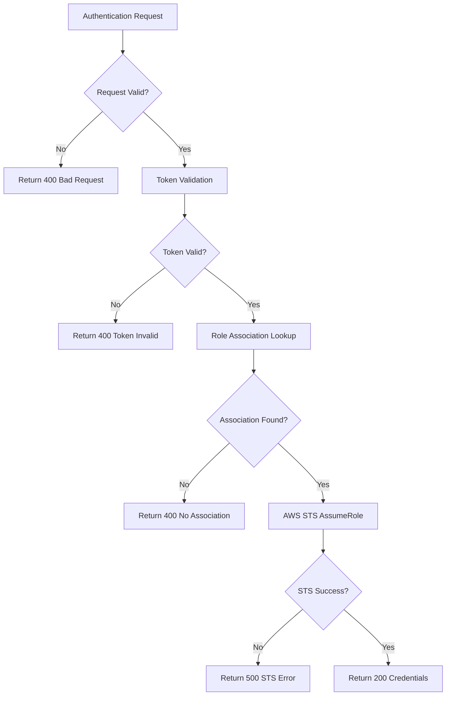

### CLI Error Handling

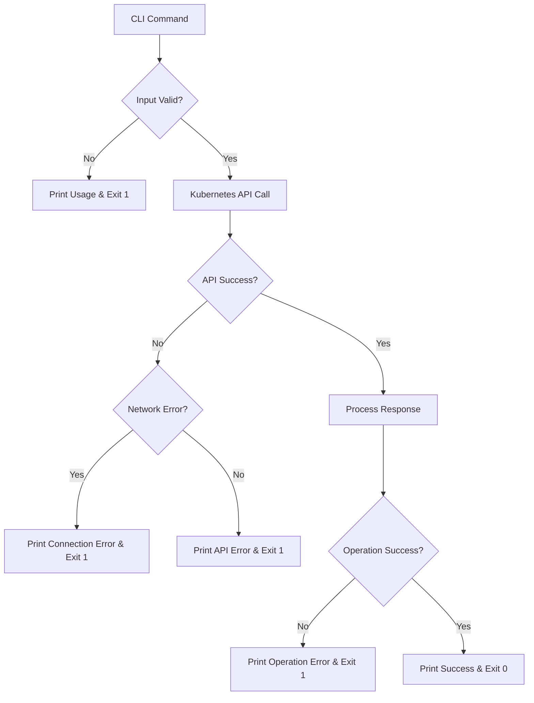

## Configuration Management Workflows

### Dynamic Configuration Updates

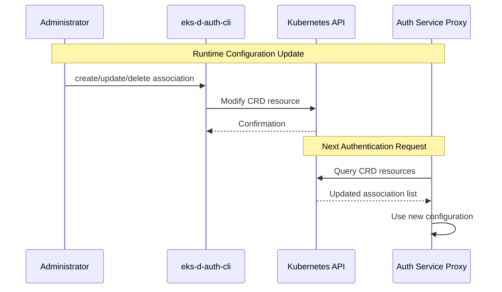

### ConfigMap Fallback Management

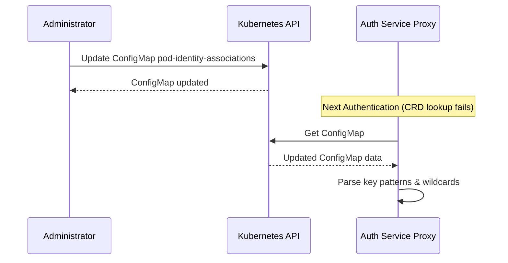

## Monitoring and Observability Workflows

### Health Check Process

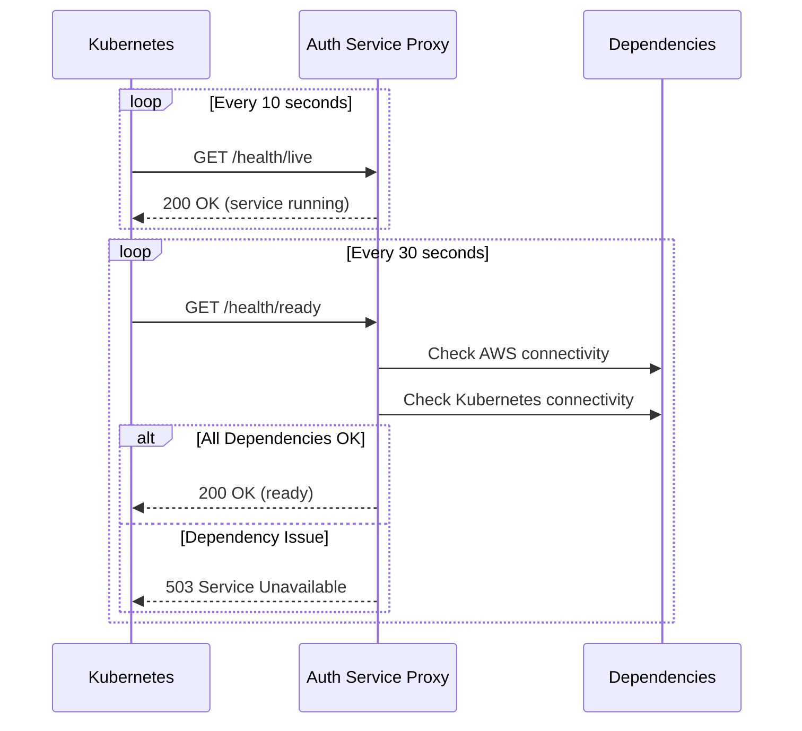

### Metrics Collection

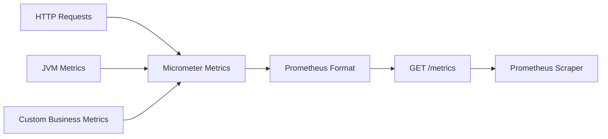

## Integration Workflows

### EKS Pod Identity Agent Integration

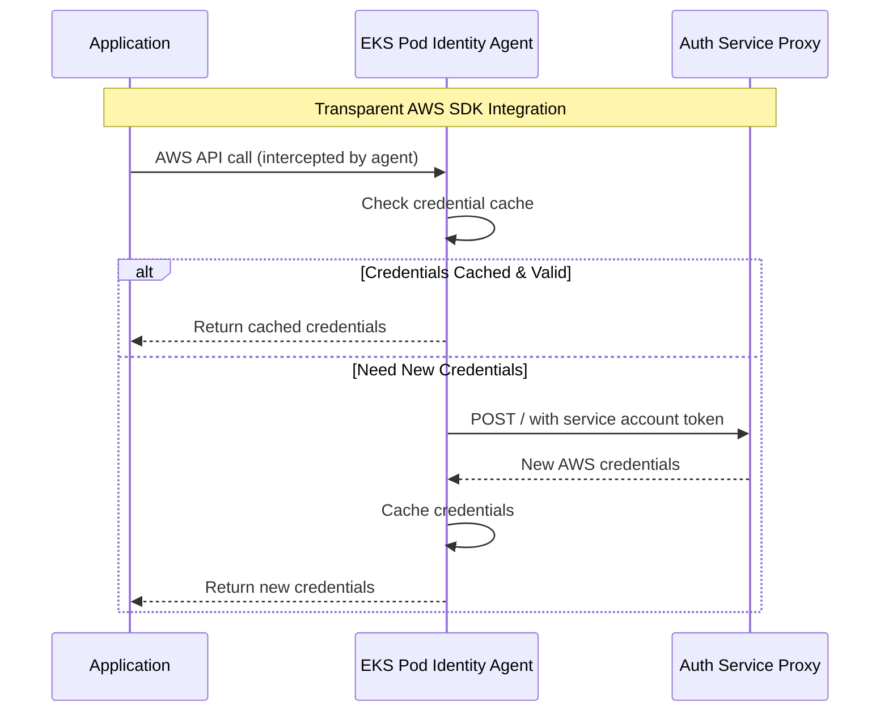

This integration allows existing AWS SDK applications to work without code changes, as the EKS Pod Identity Agent transparently handles credential acquisition and caching.
