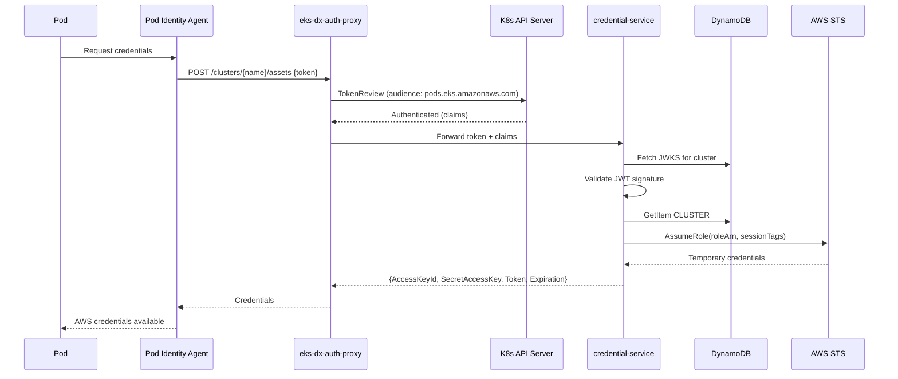
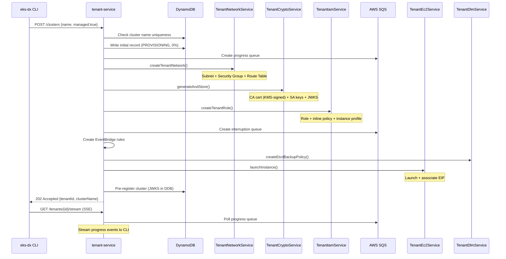
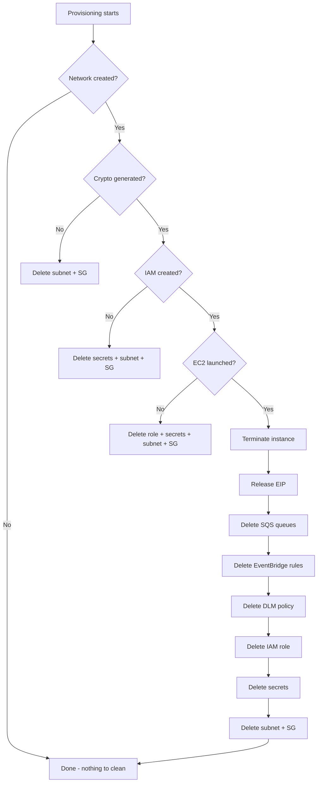
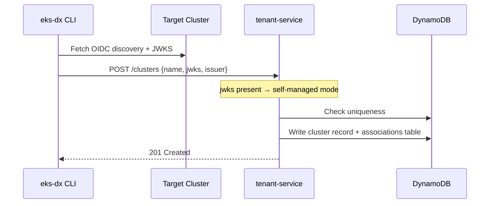
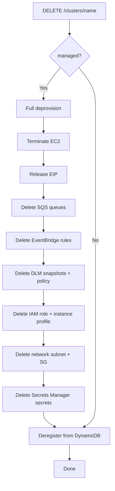
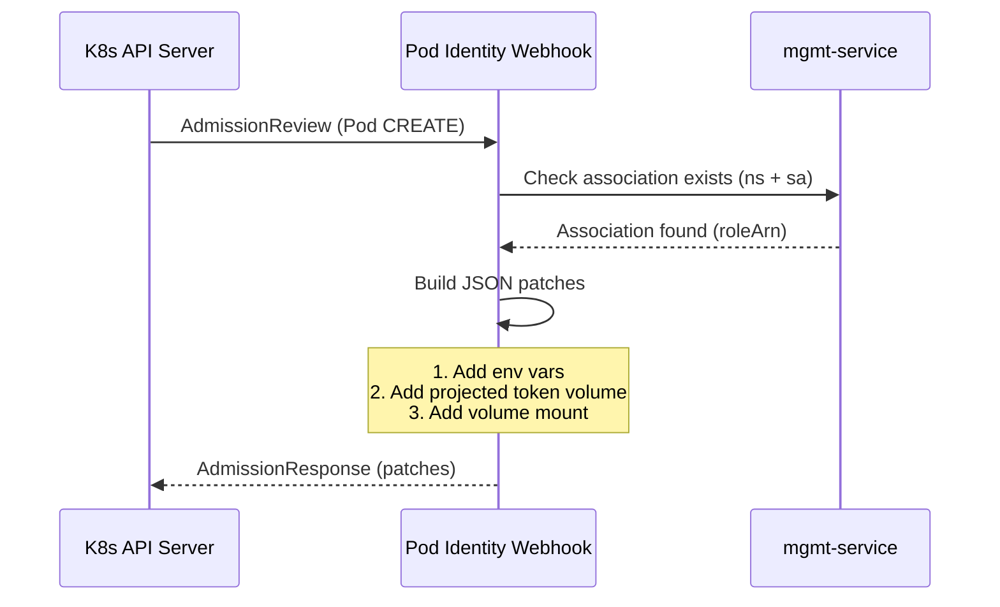
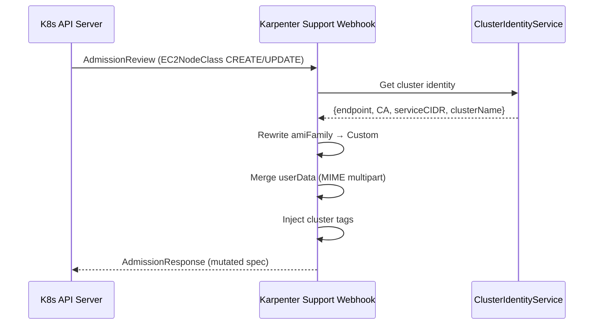
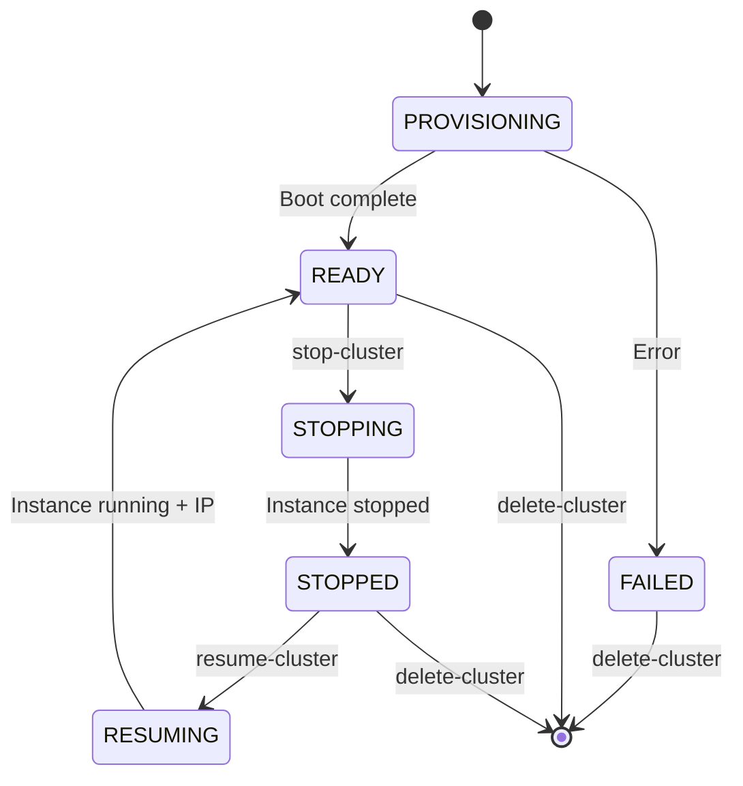

# Workflows

## Credential Exchange (Hot Path)

## Managed Cluster Provisioning

## Provisioning Rollback (Failure Compensation)

## Self-Managed Cluster Registration

## Cluster Deletion

## Pod Identity Webhook Flow

## EC2NodeClass Webhook Flow (Karpenter)

## Stop/Resume Lifecycle

