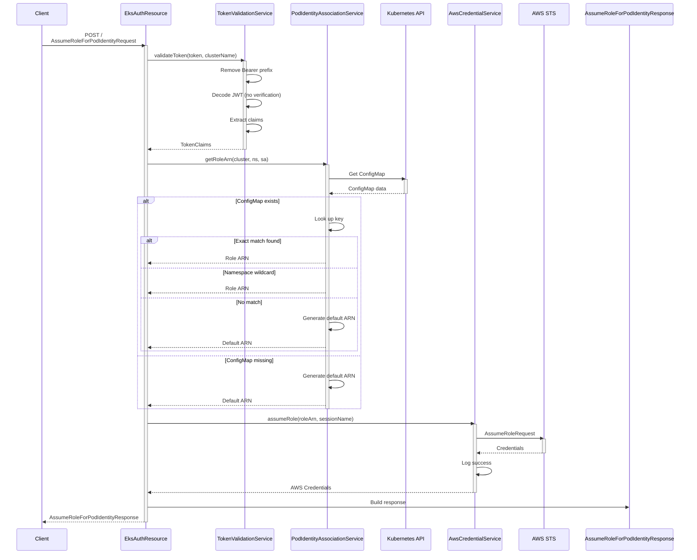
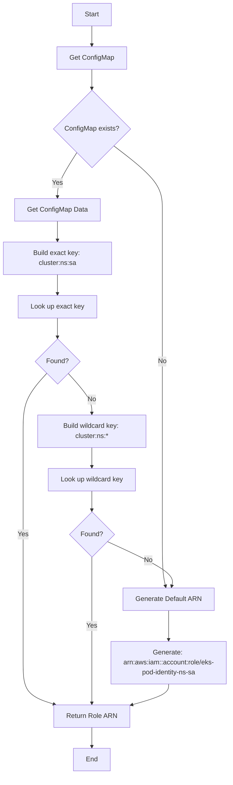
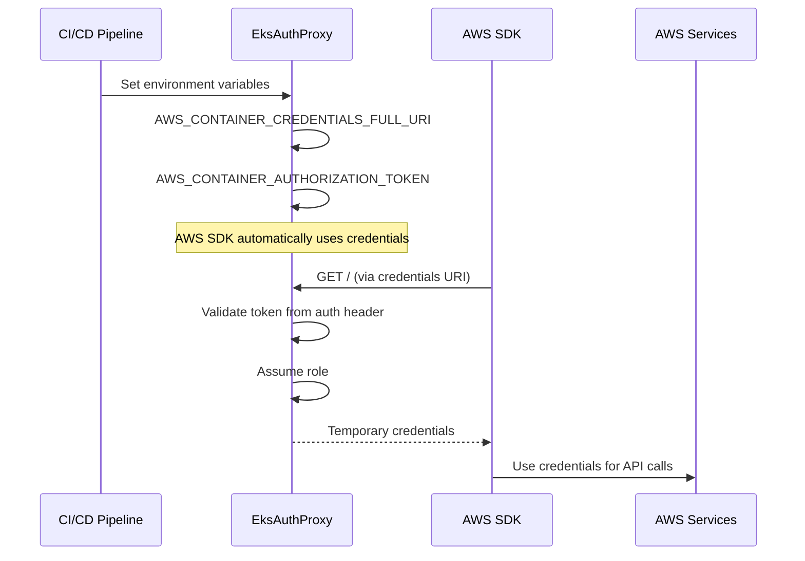
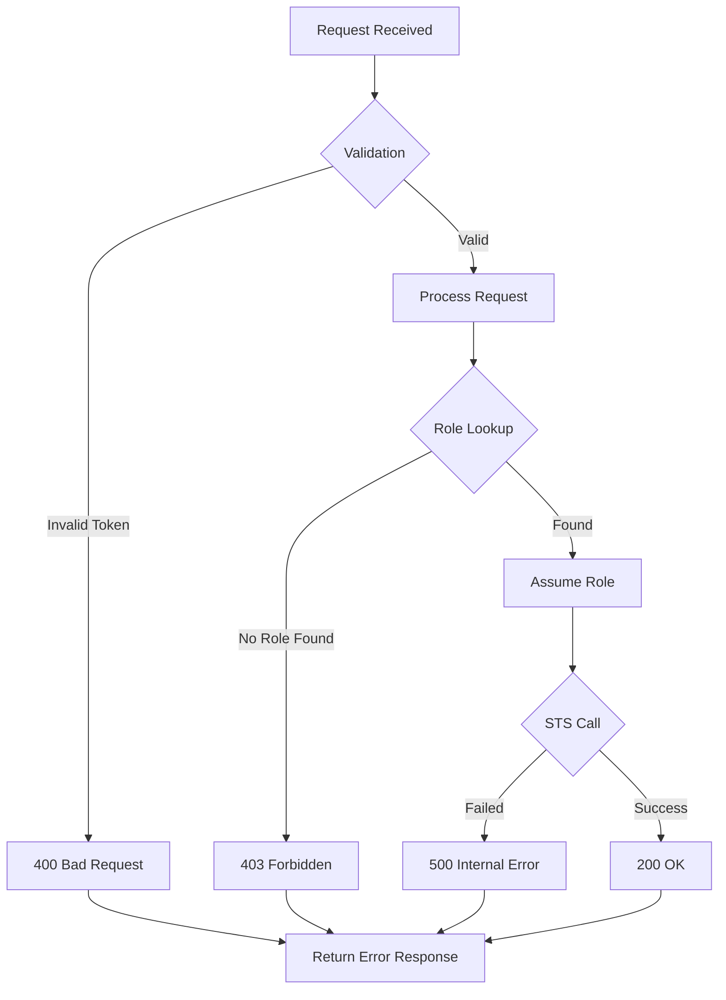

# Workflows

## AssumeRoleForPodIdentity Workflow



## Token Validation Workflow

```mermaid
sequenceDiagram
    Client->>TokenValidationService: validateToken(token, clusterName)
    activate TokenValidationService
    
    TokenValidationService->>TokenValidationService: Check Bearer prefix
    alt Has prefix
        TokenValidationService->>TokenValidationService: Remove "Bearer " prefix
    end
    
    TokenValidationService->>TokenValidationService: Decode JWT
    alt Decode failed
        TokenValidationService->>TokenValidationService: Log error
        TokenValidationService-->>Client: IllegalArgumentException
        deactivate TokenValidationService
        return
    end
    
    TokenValidationService->>TokenValidationService: Extract namespace claim
    alt Namespace missing
        TokenValidationService->>TokenValidationService: Log error
        TokenValidationService-->>Client: IllegalArgumentException
        deactivate TokenValidationService
        return
    end
    
    TokenValidationService->>TokenValidationService: Extract service account claim
    alt Service account missing
        TokenValidationService->>TokenValidationService: Log error
        TokenValidationService-->>Client: IllegalArgumentException
        deactivate TokenValidationService
        return
    end
    
    TokenValidationService->>TokenValidationService: Create TokenClaims
    TokenValidationService-->>Client: TokenClaims
    deactivate TokenValidationService
```

## Role Association Lookup Workflow



## Health Check Workflow

```mermaid
graph LR
    A[Health Check Request] --> B{Endpoint?}
    B -->|/health/live| C[Liveness Check]
    B -->|/health/ready| D[Readiness Check]
    
    C --> E[Return Status: UP]
    D --> E
    
    E --> F[Response: {status: UP, check: liveness|ready}]
```

## CI/CD Integration Workflow



## Error Handling Workflow


