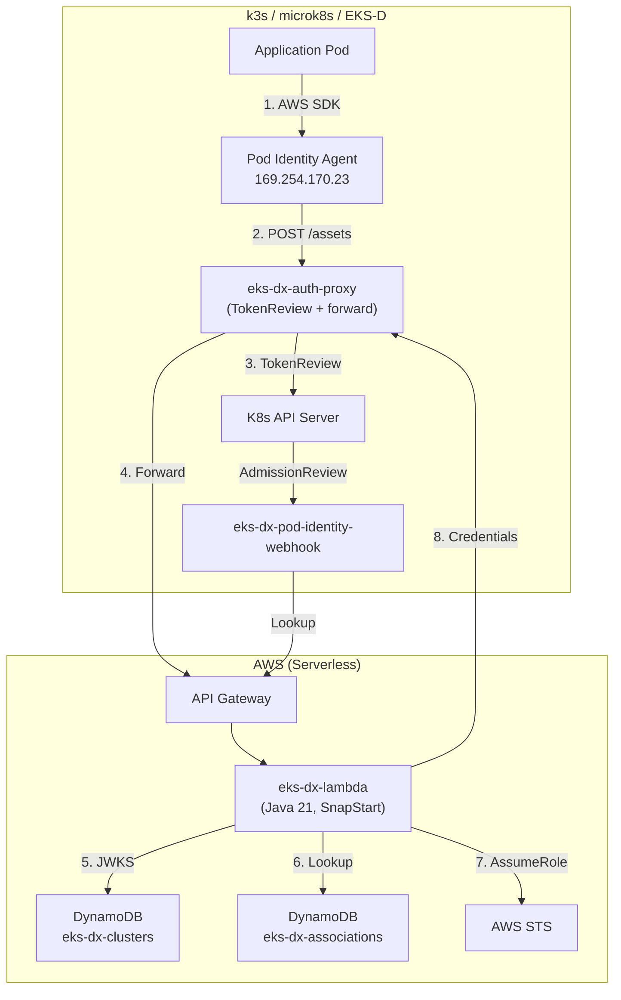

# Deploying EKS-DX

EKS Pod Identity for k3s, microk8s, and EKS-D clusters — powered by a serverless Lambda backend.

## Architecture



## Prerequisites

- AWS account with permissions to deploy Lambda, DynamoDB, API Gateway
- AWS CLI + SAM CLI (or CDK CLI)
- k3s / microk8s / EKS-D cluster
- Helm 3
- cert-manager installed in the cluster

## Step 1: Deploy the Lambda Backend

### Option A: SAM

```bash
# Build the Lambda function
mvn -pl eks-dx-lambda package -DskipTests

# Deploy
sam deploy --guided
# Stack name: eks-dx
# Region: us-east-1
# Confirm changes: Y
```

### Option B: CDK

```bash
mvn -pl eks-dx-lambda package -DskipTests
cd infra && cdk deploy
```

Save the API endpoint from the output:
```
Outputs:
  Endpoint: https://xxxxxxxxxx.execute-api.us-east-1.amazonaws.com
```

## Step 2: Configure the CLI

The CLI user/role needs `execute-api:Invoke` permission on the API Gateway:

```json
{
  "Version": "2012-10-17",
  "Statement": [{
    "Effect": "Allow",
    "Action": "execute-api:Invoke",
    "Resource": "arn:aws:execute-api:REGION:ACCOUNT_ID:API_ID/prod/*/*"
  }]
}
```

The API ID is in the endpoint URL (`https://API_ID.execute-api.REGION.amazonaws.com/prod`).

```bash
# Build the CLI
mvn -pl eks-dx-cli package -DskipTests
CLI="java -jar eks-dx-cli/target/eks-dx-cli-*-runner.jar"

# Configure endpoint
$CLI configure \
  --endpoint https://xxxxxxxxxx.execute-api.us-east-1.amazonaws.com/prod \
  --region us-east-1
```

## Step 3: Register Your Cluster

```bash
# Run from a machine with kubeconfig access to the cluster
$CLI create cluster --name my-k3s --region us-east-1

# Verify
$CLI describe cluster --name my-k3s
$CLI list clusters
```

This auto-reads the JWKS and OIDC issuer from the cluster's API server.

## Step 4: Create Pod Identity Associations

```bash
# Map a service account to an IAM role
$CLI create pod-identity-association \
  --cluster-name my-k3s \
  --namespace default \
  --service-account my-app \
  --role-arn arn:aws:iam::123456789012:role/eks-dx-pod-my-app

# List associations
$CLI list pod-identity-associations --cluster-name my-k3s
```

The target IAM role must trust the Lambda's execution role:
```json
{
  "Version": "2012-10-17",
  "Statement": [{
    "Effect": "Allow",
    "Principal": {"AWS": "arn:aws:iam::ACCOUNT:role/eks-dx-service-role"},
    "Action": ["sts:AssumeRole", "sts:TagSession"]
  }]
}
```

## Step 5: Deploy In-Cluster Components

### eks-dx-auth-proxy

```bash
# Set the Lambda endpoint
export EKS_DX_ENDPOINT=https://xxxxxxxxxx.execute-api.us-east-1.amazonaws.com

# Deploy cert-manager resources
kubectl apply -f eks-dx-auth-proxy/k8s/cert-manager.yaml

# Deploy the proxy
kubectl apply -f deploy/eks-dx-auth-proxy.yaml

# Or build and deploy via Helm
mvn -pl eks-dx-auth-proxy package -DskipTests -Dquarkus.container-image.build=true
helm install eks-dx-auth-proxy eks-dx-auth-proxy/target/helm/kubernetes/eks-dx-auth-proxy \
  -n kube-system --set env.EKS_DX_ENDPOINT=$EKS_DX_ENDPOINT
```

### EKS Pod Identity Agent

```bash
git clone https://github.com/aws/eks-pod-identity-agent.git /tmp/eks-pod-identity-agent

helm install eks-pod-identity-agent \
  /tmp/eks-pod-identity-agent/charts/eks-pod-identity-agent \
  --namespace kube-system \
  --set clusterName="my-k3s" \
  --set "agent.additionalArgs.--endpoint=http://eks-dx-auth-proxy.kube-system.svc.cluster.local:8080" \
  --set "affinity="
```

### eks-dx-pod-identity-webhook

```bash
kubectl apply -f eks-dx-pod-identity-webhook/k8s/cert-manager.yaml
kubectl apply -f eks-dx-pod-identity-webhook/k8s/deployment.yaml
kubectl apply -f eks-dx-pod-identity-webhook/k8s/mutating-webhook-configuration.yaml
```

## Step 6: Test

```bash
kubectl create serviceaccount my-app

kubectl run aws-test --image=amazon/aws-cli:latest --rm -it \
  --overrides='{"spec":{"serviceAccountName":"my-app"}}' \
  -- sts get-caller-identity
```

Expected:
```json
{
    "UserId": "AROA...:default-my-app",
    "Account": "123456789012",
    "Arn": "arn:aws:sts::123456789012:assumed-role/eks-dx-pod-my-app/default-my-app"
}
```

## JWKS Rotation

When the cluster's SA signing keys rotate:

```bash
$CLI update cluster --name my-k3s --refresh-jwks
```

## Troubleshooting

| Symptom | Check |
|---------|-------|
| CLI auth fails | Verify AWS credentials: `aws sts get-caller-identity` |
| Cluster registration fails | Ensure kubeconfig points to the right cluster |
| No association found | `$CLI list pod-identity-associations --cluster-name my-k3s` |
| Agent can't reach proxy | `kubectl logs -n kube-system -l app.kubernetes.io/name=eks-pod-identity-agent` |
| TokenReview fails | Proxy SA needs `tokenreviews` create permission |
| STS AssumeRole fails | Target role must trust the Lambda execution role |
| Webhook not mutating pods | `kubectl get mutatingwebhookconfigurations` |

## Cleanup

```bash
# Remove in-cluster components
helm uninstall eks-pod-identity-agent -n kube-system
kubectl delete -f deploy/eks-dx-auth-proxy.yaml
kubectl delete -f eks-dx-pod-identity-webhook/k8s/

# Remove associations and cluster
$CLI delete pod-identity-association --cluster-name my-k3s --association-id <id>
$CLI delete cluster --name my-k3s

# Remove Lambda backend
sam delete --stack-name eks-dx
# or: cd infra && cdk destroy
```
