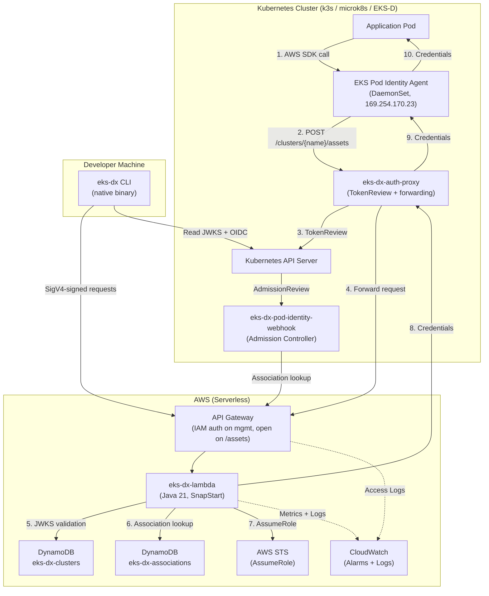
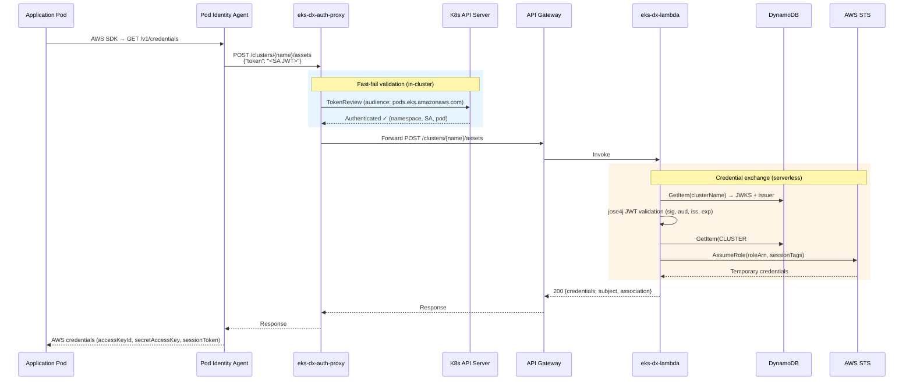
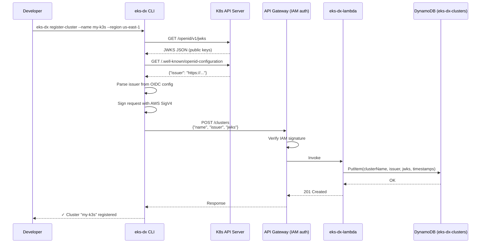
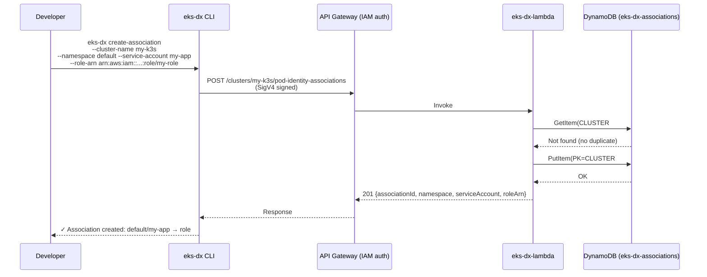
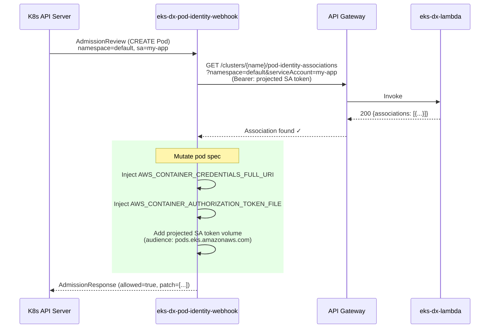
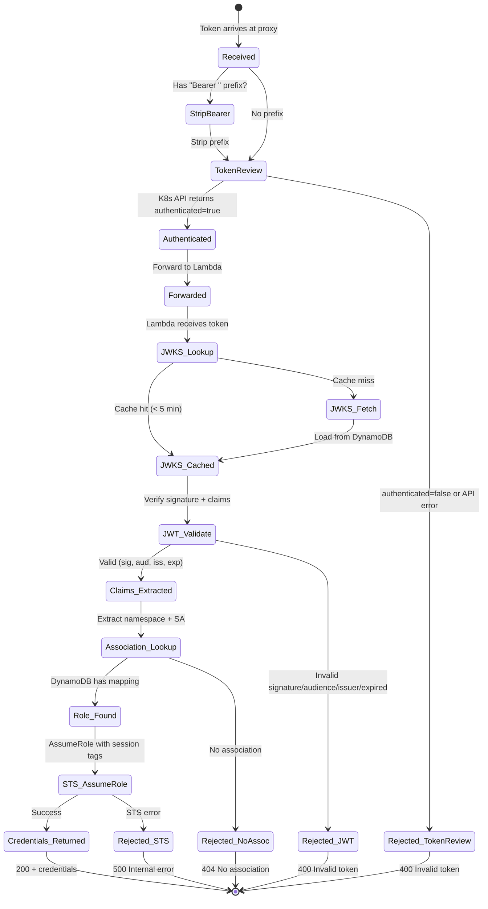
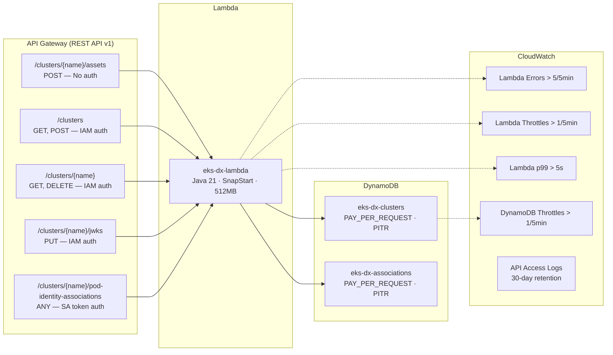
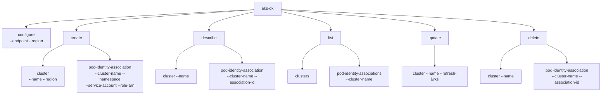
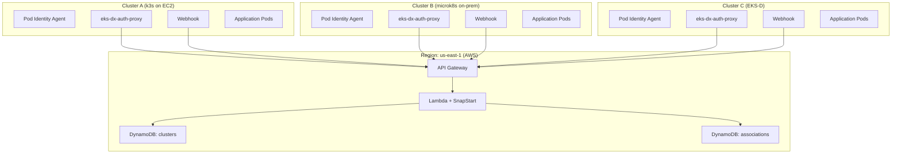

# EKS-DX Architecture

## 1. System Overview



## 2. Credential Exchange Flow (Main Use Case)



## 3. Cluster Registration Flow



## 4. Pod Identity Association Management



## 5. Webhook Pod Mutation Flow



## 6. Token Validation State Machine



## 7. DynamoDB Data Model

```mermaid
erDiagram
    CLUSTERS {
        string clusterName PK "Partition key"
        string issuer "OIDC issuer URL"
        string jwks "JSON Web Key Set (public keys)"
        string createdAt "ISO 8601 timestamp"
        string updatedAt "ISO 8601 timestamp"
    }

    ASSOCIATIONS {
        string partitionKey PK "CLUSTER#{clusterName}"
        string sortKey SK "namespace#serviceAccount"
        string associationId "assoc-{uuid}"
        string clusterName "Cluster name"
        string namespace "K8s namespace"
        string serviceAccount "K8s service account"
        string roleArn "IAM role ARN"
        string createdAt "ISO 8601 timestamp"
    }

    CLUSTERS ||--o{ ASSOCIATIONS : "has"
```

## 8. Infrastructure Components



## 9. CLI Command Tree



## 10. Deployment Topology


