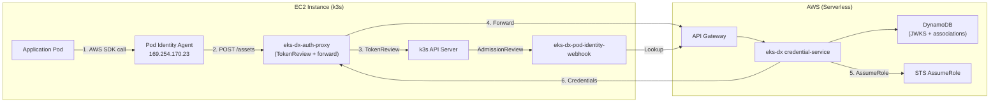

# EKS Pod Identity on EC2 + k3s

> **Full tutorial** — walks through everything from EC2 launch to working Pod Identity.
> For a concise reference if you already have k3s running, see [integration-k3s.md](../integration-k3s.md).

Run EKS Pod Identity on a plain EC2 instance with k3s — no managed EKS cluster required. Pods get temporary AWS credentials exactly as they would on managed EKS.

## Architecture



Flow:
  1. Webhook queries Lambda API for associations → mutates pod
  2. AWS SDK in pod → calls Agent at 169.254.170.23/v1/credentials
  3. Agent → calls eks-dx-auth-proxy via --endpoint flag
  4. Proxy → TokenReview (k3s API) → forwards to Lambda API
  5. Lambda → JWKS validation + association lookup + STS AssumeRole
  6. Temporary credentials returned to pod

## Prerequisites

- Lambda backend deployed (`cdk deploy` — see [deploy guide](../../../deploy/README.md))
- `eks-dx` CLI built (`./build-local.sh --only cli --native`)
- AWS CLI v2 configured
- An EC2 key pair in the target region
- Helm 3

## Quick Start (Automated)

```bash
./setup.sh --eks-dx-endpoint https://xxxxxxxxxx.execute-api.us-east-1.amazonaws.com/prod \
  --version 1.0.0
```

## Manual Setup

### 1. Deploy the Lambda Backend

```bash
./build-local.sh --only credential,mgmt,tenant --skip-tests
./deploy-local.sh --skip-build
```

Save the endpoint from the CDK output:
```
Outputs:
  EksDXpressControlPlaneStack.Endpoint = https://xxxxxxxxxx.execute-api.us-east-1.amazonaws.com/prod
```

### 2. Launch EC2 + Install k3s

```bash
aws ec2 run-instances \
  --image-id <ubuntu-22.04-ami> \
  --instance-type t4g.medium \
  --key-name my-key \
  --user-data '#!/bin/bash
    apt-get update -qq && apt-get install -y -qq curl
    PUBLIC_IP=$(curl -sf http://169.254.169.254/latest/meta-data/public-ipv4)
    curl -sfL https://get.k3s.io | INSTALL_K3S_EXEC="--disable traefik --disable servicelb --tls-san ${PUBLIC_IP}" sh -
    mkdir -p /home/ubuntu/.kube
    cp /etc/rancher/k3s/k3s.yaml /home/ubuntu/.kube/config
    chown -R ubuntu:ubuntu /home/ubuntu/.kube'
```

Open ports 22 (SSH) and 6443 (k3s API) in your security group to your local IP.

After fetching the kubeconfig, replace the loopback address with the public IP:
```bash
scp -i my-key.pem ubuntu@<ip>:/etc/rancher/k3s/k3s.yaml /tmp/my-k3s-kubeconfig.yaml
sed -i "s|https://127.0.0.1:6443|https://<ip>:6443|g" /tmp/my-k3s-kubeconfig.yaml
export KUBECONFIG=/tmp/my-k3s-kubeconfig.yaml
```

> **Note:** The `--tls-san <public-ip>` flag ensures the k3s server TLS cert includes the public IP as a Subject Alternative Name, so the kubeconfig CA trust works without `insecure-skip-tls-verify`. See [k3s server `--tls-san` docs](https://docs.k3s.io/cli/server#listeners).

### 3. Register the Cluster

```bash
# Configure CLI endpoint
eks-dx configure --endpoint https://xxxxxxxxxx.execute-api.us-east-1.amazonaws.com/prod --region us-east-1

# Register cluster (auto-reads JWKS + OIDC issuer from kubeconfig)
eks-dx register-cluster --name my-k3s --region us-east-1

# Verify
eks-dx describe-cluster --name my-k3s
```

### 4. Create Pod Identity Associations

For detailed IAM role setup instructions, see [IAM Role Setup](../iam/iam-role-setup.md).

```bash
ACCOUNT_ID=$(aws sts get-caller-identity --query Account --output text)

# Create a target IAM role
aws iam create-role \
  --role-name my-app-role \
  --assume-role-policy-document '{"Version":"2012-10-17","Statement":[]}'

# Tag it so EKS-DX manages the trust policy automatically
aws iam tag-role \
  --role-name my-app-role \
  --tags Key=eks-dx-managed,Value=true

aws iam attach-role-policy \
  --role-name my-app-role \
  --policy-arn arn:aws:iam::aws:policy/AmazonS3ReadOnlyAccess

# Register the association (trust policy is configured automatically)
eks-dx create-association \
  --cluster-name my-k3s \
  --namespace default \
  --service-account my-app \
  --role-arn arn:aws:iam::${ACCOUNT_ID}:role/my-app-role
```

### 5. Deploy In-Cluster Components

A single script installs cert-manager, eks-dx-auth-proxy, eks-dx-pod-identity-webhook, and eks-pod-identity-agent:

```bash
curl -sL https://github.com/plasticity-of-cloud/eks-d-xpress/releases/latest/download/install-eks-dx-pod-identity.sh \
  | CLUSTER_NAME=my-k3s AWS_REGION=us-east-1 EKS_DX_ENDPOINT=https://xxxxxxxxxx.execute-api.us-east-1.amazonaws.com/prod bash
```

The script resolves `EKS_DX_ENDPOINT` from SSM (`/eks-d-xpress/control-plane/api/endpoint`) automatically if your instance has SSM access. Pass it explicitly otherwise.

### 6. Test

```bash
kubectl run aws-test --image=amazon/aws-cli:latest --rm -it \
  --overrides='{"spec":{"serviceAccountName":"my-app"}}' \
  -- sts get-caller-identity
```

Expected:
```json
{
    "UserId": "AROA...:default-my-app",
    "Account": "123456789012",
    "Arn": "arn:aws:sts::123456789012:assumed-role/eks-dx-pod-my-app/default-my-app"
}
```

## IAM Summary

| Role | Permissions | Purpose |
|------|-------------|---------|
| EksDXCredentialBroker (Lambda) | `sts:AssumeRole` + `sts:TagSession` + `sts:SetSourceIdentity` | Assumes target roles on behalf of pods |
| Mgmt-service (Lambda) | `iam:GetRole` + `iam:UpdateAssumeRolePolicy` (tag-gated) | Manages trust policies on tagged roles |
| Target roles | Whatever the app needs | Assumed by broker; trust policy auto-managed if tagged `eks-dx-managed=true` |
| EC2 instance | None required | k3s only — no AWS API calls from the node |

## Troubleshooting

| Symptom | Check |
|---------|-------|
| Agent can't reach proxy | `kubectl logs -n kube-system -l app.kubernetes.io/name=eks-pod-identity-agent` |
| Agent not scheduled | Ensure `--set "affinity="` was passed to Helm |
| TokenReview fails | Proxy SA needs `tokenreviews` create permission |
| Lambda returns 400 | `eks-dx describe-cluster --name my-k3s` — verify cluster is registered |
| No association found | `eks-dx list-associations --cluster-name my-k3s` |
| STS AssumeRole fails | Target role must trust the Lambda execution role |
| Webhook not mutating | `kubectl get mutatingwebhookconfigurations` |
| kubectl connection refused | Ensure port 6443 is open in the EC2 security group to your IP |

## Cleanup

```bash
# In-cluster
helm uninstall eks-pod-identity-agent -n kube-system
helm uninstall eks-dx-auth-proxy -n kube-system
helm uninstall eks-dx-pod-identity-webhook -n kube-system
kubectl delete -f https://github.com/cert-manager/cert-manager/releases/latest/download/cert-manager.yaml

# Associations + cluster
eks-dx delete-association --cluster-name my-k3s --association-id <id>
eks-dx deregister-cluster --name my-k3s

# EC2
aws ec2 terminate-instances --instance-ids <instance-id>

# Target IAM roles
aws iam detach-role-policy --role-name my-app-role \
  --policy-arn arn:aws:iam::aws:policy/AmazonS3ReadOnlyAccess
aws iam delete-role --role-name my-app-role

# Lambda backend (optional — shared across clusters)
./destroy-local.sh
```

## References

- [k3s server CLI — `--tls-san` flag](https://docs.k3s.io/cli/server#listeners)
- [k3s certificate management](https://docs.k3s.io/advanced#certificate-management)
- [EKS Pod Identity Agent](https://github.com/aws/eks-pod-identity-agent)
- [cert-manager](https://cert-manager.io/docs/installation/)
- [ECR Credential Helper](https://github.com/awslabs/amazon-ecr-credential-helper)
