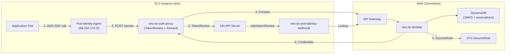

# EKS Pod Identity on EC2 + k3s

Run EKS Pod Identity on a plain EC2 instance with k3s — no managed EKS cluster required. Pods get temporary AWS credentials exactly as they would on managed EKS.

## Architecture



Flow:
  1. Webhook queries Lambda API for associations → mutates pod
  2. AWS SDK in pod → calls Agent at 169.254.170.23/v1/credentials
  3. Agent → calls eks-dx-auth-proxy via --endpoint flag
  4. Proxy → TokenReview (k3s API) → forwards to Lambda API
  5. Lambda → JWKS validation + association lookup + STS AssumeRole
  6. Temporary credentials returned to pod
```

## Prerequisites

- Lambda backend deployed (`sam deploy` — see [deploy/README.md](../../deploy/README.md))
- `eks-dx` CLI built (`mvn -pl eks-dx-cli package -DskipTests`)
- AWS CLI v2 configured
- An EC2 key pair in the target region
- Helm 3

## Quick Start (Automated)

```bash
./setup.sh --key-pair my-key --region us-east-1 \
  --eks-dx-endpoint https://xxxxxxxxxx.execute-api.us-east-1.amazonaws.com/prod
```

## Manual Setup

### 1. Deploy the Lambda Backend

If not already deployed:

```bash
cd eks-dx-control-plane
mvn -pl eks-dx-lambda package -DskipTests
sam deploy -t sam.yaml --stack-name eks-dx --region us-east-1 \
  --capabilities CAPABILITY_IAM --resolve-s3 --no-confirm-changeset
```

Save the endpoint from the output:
```
Endpoint: https://xxxxxxxxxx.execute-api.us-east-1.amazonaws.com/prod
```

### 2. Launch EC2 + Install k3s

No special IAM broker role needed — STS is handled by the Lambda.

```bash
aws ec2 run-instances \
  --image-id <ubuntu-22.04-ami> \
  --instance-type t4g.medium \
  --key-name my-key \
  --user-data '#!/bin/bash
    apt-get update -qq && apt-get install -y -qq curl
    PUBLIC_IP=$(curl -sf http://169.254.169.254/latest/meta-data/public-ipv4)
    curl -sfL https://get.k3s.io | INSTALL_K3S_EXEC="--disable traefik --disable servicelb --tls-san ${PUBLIC_IP}" sh -
    mkdir -p /home/ubuntu/.kube
    cp /etc/rancher/k3s/k3s.yaml /home/ubuntu/.kube/config
    chown -R ubuntu:ubuntu /home/ubuntu/.kube'
```

After fetching the kubeconfig, replace the loopback address with the public IP:
```bash
scp -i my-key.pem ubuntu@<ip>:/etc/rancher/k3s/k3s.yaml /tmp/my-k3s-kubeconfig.yaml
sed -i "s|https://127.0.0.1:6443|https://<ip>:6443|g" /tmp/my-k3s-kubeconfig.yaml
export KUBECONFIG=/tmp/my-k3s-kubeconfig.yaml
```

> **Note:** The `--tls-san <public-ip>` flag ensures the k3s server TLS cert includes the public IP as a Subject Alternative Name, so the kubeconfig CA trust works without `insecure-skip-tls-verify`. See [k3s server `--tls-san` docs](https://docs.k3s.io/cli/server#listeners).

SSH in and verify:
```bash
ssh -i my-key.pem ubuntu@<ip>
kubectl get nodes   # should show Ready
```

### 3. Register the Cluster

From a machine with kubeconfig access and the CLI:

```bash
CLI="java -jar eks-dx-cli/target/eks-dx-cli-*-runner.jar"

# Configure CLI endpoint
$CLI configure --endpoint https://xxxxxxxxxx.execute-api.us-east-1.amazonaws.com/prod --region us-east-1

# Register cluster (auto-reads JWKS + OIDC issuer from kubeconfig)
$CLI create cluster --name my-k3s --region us-east-1

# Verify
$CLI describe cluster --name my-k3s
```

### 4. Create Pod Identity Associations

```bash
# Create a target IAM role that the Lambda can assume
ACCOUNT_ID=$(aws sts get-caller-identity --query Account --output text)
LAMBDA_ROLE=$(aws cloudformation describe-stacks --stack-name eks-dx \
  --query 'Stacks[0].Outputs[?OutputKey==`FunctionArn`].OutputValue' --output text | \
  sed 's/function.*//')

aws iam create-role \
  --role-name eks-dx-pod-my-app \
  --assume-role-policy-document '{
    "Version": "2012-10-17",
    "Statement": [{
      "Effect": "Allow",
      "Principal": {"AWS": "arn:aws:iam::'$ACCOUNT_ID':root"},
      "Action": ["sts:AssumeRole", "sts:TagSession"]
    }]
  }'

aws iam attach-role-policy \
  --role-name eks-dx-pod-my-app \
  --policy-arn arn:aws:iam::aws:policy/AmazonS3ReadOnlyAccess

# Register the association
$CLI create pod-identity-association \
  --cluster-name my-k3s \
  --namespace default \
  --service-account my-app \
  --role-arn arn:aws:iam::${ACCOUNT_ID}:role/eks-dx-pod-my-app
```

### 5. Deploy In-Cluster Components

```bash
EKS_DX_ENDPOINT=https://xxxxxxxxxx.execute-api.us-east-1.amazonaws.com/prod

# cert-manager (for webhook TLS)
kubectl apply -f https://github.com/cert-manager/cert-manager/releases/latest/download/cert-manager.yaml
kubectl wait --for=condition=Available deployment/cert-manager-webhook -n cert-manager --timeout=120s

# eks-dx-auth-proxy
kubectl apply -f eks-dx-auth-proxy/k8s/cert-manager.yaml
kubectl apply -f deploy/eks-dx-auth-proxy.yaml
# Set the Lambda endpoint
kubectl set env deployment/eks-dx-auth-proxy -n kube-system EKS_DX_ENDPOINT=$EKS_DX_ENDPOINT

# eks-dx-pod-identity-webhook
kubectl apply -f eks-dx-pod-identity-webhook/k8s/cert-manager.yaml
kubectl apply -f eks-dx-pod-identity-webhook/k8s/deployment.yaml
kubectl set env deployment/eks-dx-pod-identity-webhook -n kube-system \
  EKS_DX_ENDPOINT=$EKS_DX_ENDPOINT EKS_CLUSTER_NAME=my-k3s
kubectl apply -f eks-dx-pod-identity-webhook/k8s/mutating-webhook-configuration.yaml

# EKS Pod Identity Agent
git clone --depth=1 https://github.com/aws/eks-pod-identity-agent.git /tmp/eks-pod-identity-agent

# Pull secret for the agent image (hosted in AWS ECR us-west-2)
kubectl create secret docker-registry ecr-secret-us-west-2 \
  --namespace kube-system \
  --docker-server=602401143452.dkr.ecr.us-west-2.amazonaws.com \
  --docker-username=AWS \
  --docker-password="$(aws ecr get-login-password --region us-west-2)"

helm install eks-pod-identity-agent \
  /tmp/eks-pod-identity-agent/charts/eks-pod-identity-agent \
  --namespace kube-system \
  --set clusterName="$CLUSTER_NAME" \
  --set env.AWS_REGION="us-east-1" \
  --set "agent.additionalArgs.--endpoint=http://eks-dx-auth-proxy.kube-system.svc.cluster.local:8080" \
  --set "affinity=" \
  --set "imagePullSecrets[0].name=ecr-secret-us-west-2"
```

### 6. Test

```bash
kubectl create serviceaccount my-app

kubectl run aws-test --image=amazon/aws-cli:latest --rm -it \
  --overrides='{"spec":{"serviceAccountName":"my-app"}}' \
  -- sts get-caller-identity
```

Expected:
```json
{
    "UserId": "AROA...:default-my-app",
    "Account": "123456789012",
    "Arn": "arn:aws:sts::123456789012:assumed-role/eks-dx-pod-my-app/default-my-app"
}
```

## IAM Summary

| Role | Permissions | Purpose |
|------|-------------|---------|
| Lambda execution role | `dynamodb:*` on eks-dx tables, `sts:AssumeRole` on `eks-dx-pod-*` | Managed by SAM/CDK |
| Target roles (`eks-dx-pod-*`) | Whatever the app needs | Assumed by Lambda on behalf of pods |
| EC2 instance | None required | k3s only — no AWS API calls from the node |

## Troubleshooting

| Symptom | Check |
|---------|-------|
| Agent can't reach proxy | `kubectl logs -n kube-system -l app.kubernetes.io/name=eks-pod-identity-agent` |
| Agent not scheduled | Ensure `--set "affinity="` was passed to Helm |
| TokenReview fails | Proxy SA needs `tokenreviews` create permission |
| Lambda returns 400 | `$CLI describe cluster --name my-k3s` — verify cluster is registered |
| No association found | `$CLI list pod-identity-associations --cluster-name my-k3s` |
| STS AssumeRole fails | Target role must trust the Lambda execution role |
| Webhook not mutating | `kubectl get mutatingwebhookconfigurations` |

## Cleanup

```bash
# In-cluster
helm uninstall eks-pod-identity-agent -n kube-system
kubectl delete -f deploy/eks-dx-auth-proxy.yaml
kubectl delete -f eks-dx-pod-identity-webhook/k8s/

# Associations + cluster
$CLI delete pod-identity-association --cluster-name my-k3s --association-id <id>
$CLI delete cluster --name my-k3s

# EC2
aws ec2 terminate-instances --instance-ids <instance-id>

# Target IAM roles
aws iam detach-role-policy --role-name eks-dx-pod-my-app \
  --policy-arn arn:aws:iam::aws:policy/AmazonS3ReadOnlyAccess
aws iam delete-role --role-name eks-dx-pod-my-app

# Lambda backend (optional — shared across clusters)
# sam delete --stack-name eks-dx
```

## References

- [k3s server CLI — `--tls-san` flag](https://docs.k3s.io/cli/server#listeners)
- [k3s certificate management](https://docs.k3s.io/advanced#certificate-management)
- [k3s installation configuration](https://docs.k3s.io/installation/configuration)
- [EKS Pod Identity Agent](https://github.com/aws/eks-pod-identity-agent)
- [cert-manager](https://cert-manager.io/docs/installation/)
